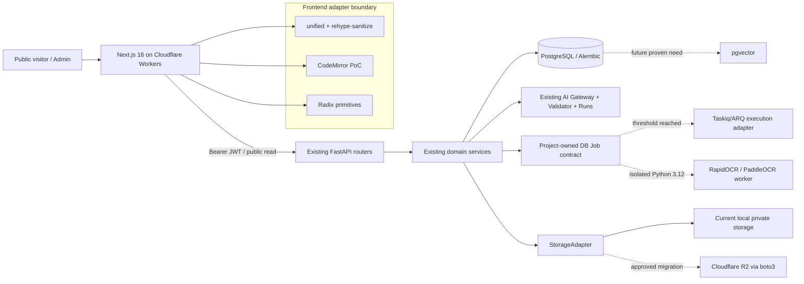

# GitHub 开源项目实现方案与技术选型报告

## 1. 文档信息

| 项目 | 内容 |
| --- | --- |
| 项目 | `waterisgoodthing/new-2025-blog-for-knowledge` |
| 报告版本 | v1.0 |
| 审查日期 | 2026-08-02（Asia/Shanghai） |
| 本地基线 | `refactor/baseline`，commit `202ea14d3362a84a491a7a8e32d2afd5d2e0bc1f` |
| 任务域 | shared infrastructure / architecture documentation；只读检查 `src/` 与 `backend/` |
| 输出边界 | 本报告不授权业务代码、数据库、部署、认证配置、Commit 或 Push 变更 |
| 证据等级 | `VERIFIED`、`PARTIALLY_VERIFIED`、`UNVERIFIED` |

本报告是工程选型意见，不构成法律、合规或安全保证。Star、Issue、Release 和更新时间均为 2026-08-02 的观察值，会随上游变化。

## 2. 执行摘要

当前项目不是单纯博客，而是“公开内容系统 + 私有个人学习管理系统”：Cloudflare Workers 承载 Next.js 16 前端，独立 FastAPI 服务承载 PostgreSQL、JWT/Passkey、笔记、题库、错题、复习、附件、Capture 和 AI 审计。现有领域模型、权限、SM-2、PostgreSQL 搜索和 AI Run/Call Log 已形成项目特有资产，不应由通用开源系统整体替换。

推荐组合如下：

1. **立即进入隔离 PoC**：`unified + remark/rehype + rehype-sanitize`，替换当前缺少集中白名单净化的 Markdown HTML 管线。
2. **增量直接引入**：Radix Primitives，仅用于 Dialog、Popover、Dropdown/Menu 等高风险交互原语；保留现有视觉层，不整体套用组件主题。
3. **条件性 PoC**：`@uiw/react-codemirror`，为 Markdown 源码编辑提供可访问、可扩展的编辑器内核；先证明 React 19、输入法、移动端和包体积。
4. **条件性服务化接入**：RapidOCR 为 CPU 友好的图片 OCR 主候选，PaddleOCR 为准确率备用；必须在 Python 3.12 隔离 worker 中验证真实中文、公式、手写样本。
5. **条件性 SDK 集成**：当本地附件确有迁移需求时，用 boto3 通过存储适配层接 Cloudflare R2；MinIO Python SDK 为 S3 兼容备用。
6. **暂不直接引入**：第一版后台任务继续采用文档既定 PostgreSQL `jobs + SKIP LOCKED`；Taskiq 仅在吞吐/隔离证据出现后评估。保留现有 AI Gateway/Validator；Instructor 只做结构化抽取实验。继续使用 PostgreSQL FTS/`pg_trgm`；pgvector 等到语义检索需求和评测集成立后再评估。

**Gate：`CONDITIONAL_PASS`。** 可以进入 Phase 0 的依赖、许可证和最小 PoC 验证，不能直接进入全量编码或架构替换。

## 3. 当前项目概况

### 3.1 Git 与运行基线

| 项目 | 结果 |
| --- | --- |
| 工作目录 | `/Users/limengyang/2025-blog-public` |
| 分支 | `refactor/baseline`，跟踪 `mine/refactor/baseline` |
| HEAD | `202ea14 docs: record CI clean-check verification` |
| 工作区 | 0 个 tracked change；审查时存在 4 个未跟踪入口，均保留 |
| 未跟踪内容 | `docs/refactor-github-opensource-report.md`、`docs/refactor-plan-2026-08-02.md`、Cloudflare 发布工作流、本报告工作流 |
| 最近提交 | `202ea14`、`236dcc3`、`37ece86`、`c50b434`、`eb758af`、`26adb44`、`a7a89b7`、`a1b39eb`、`c12af9a`、`beb7897` |
| 当前机器 | macOS 27.0 arm64；Node 26.0.0；npm 11.12.1；Python 3.14.6；PostgreSQL client 16.14 |
| 项目约束 | `package.json` 要求 Node 24.x；README 建议后端 Python 3.12/3.13，明确不建议 3.14 |

### 3.2 主要目录与技术栈

```text
repository/
├── src/                       # Next.js App Router public/admin frontend
│   ├── app/
│   ├── components/
│   ├── hooks/
│   └── lib/api/
├── backend/
│   ├── app/{routers,schemas,services,models}/
│   ├── alembic/versions/      # 27 migration files; expected revision 025
│   └── tests/                 # 49 test files
├── scripts/                   # setup/check/predeploy gates
├── .github/workflows/ci.yml
├── open-next.config.ts
├── wrangler.toml
└── docs/
```

| 层 | 当前技术 |
| --- | --- |
| 前端 | Next.js 16.2.12、React 19.2.1、Tailwind CSS 4、Motion、SWR、Zustand |
| 内容渲染 | marked 17、html-react-parser、Shiki、KaTeX、Mermaid、Markmap |
| 后端 | FastAPI 0.115.12、Pydantic 2.11、SQLAlchemy async 2.0、asyncpg |
| 数据 | PostgreSQL + Alembic；当前启动只读检查 revision `025` |
| 身份 | 后端 JWT、管理员会话、Passkey/WebAuthn；生产禁止双 `AUTH_BYPASS` |
| 部署 | OpenNext/Cloudflare Workers 前端；FastAPI 是独立运行时；无 Dockerfile/Compose 基线 |
| CI | Node 24 前端 typecheck/build；Python 3.12 + PostgreSQL 16 后端 import/migration/pytest |

### 3.3 核心业务链路

```text
公开访客 -> blog / notes / mistakes published reads
管理员 -> /manage -> capture / question / mistake / review / attachment / AI audit
附件 -> Capture/识别 -> 草稿 -> 人工确认 -> Question -> Mistake -> Review Item/Record
```

已完成的关键能力包括：公开/管理员权限边界、独立 Question/Mistake/Review 模型、附件元数据与私有下载、Capture、AI Gateway、Pydantic 输出校验、AI Runs/Call Logs、PostgreSQL FTS/`pg_trgm`、Cloudflare 前端发布门禁和较完整测试基线。未完成或仍需证据的能力包括：统一安全 Markdown AST 管线、生产级对象存储、真实本地 OCR 日常流、后台任务表/worker、语义检索和跨环境容器化。

## 4. 原技术文档审查

### 4.1 审查范围

核心文档包括 `README.md`、`SYSTEM_MAP.md`、`docs/architecture/*`、`docs/refactor-plan-2026-08-02.md`、`docs/refactor-plan/*`、`docs/final-system-boundary.md`、`docs/releases/v1.0-baseline.md`、`CODEX-OUTCOME-REVIEW.md` 以及执行期间出现的 `docs/refactor-github-opensource-report.md`。

### 4.2 问题清单

| 编号 | 问题 | 证据位置 | 影响 | 严重程度 | 修订建议 |
| --- | --- | --- | --- | --- | --- |
| D-01 | `SYSTEM_MAP.md` 仍称 GitHub Sync 和认证绕过为当前实现 | `SYSTEM_MAP.md` 对比 `backend/main.py` 与 `docs/final-system-boundary.md` | 错误指导新实现 | CRITICAL | 标记历史快照或更新现状 |
| D-02 | 多份 `docs/architecture/*` 标注“待实现”，但 011-025 migrations 和实际 routers 已实现大量模块 | `docs/architecture/backend-structure.md`、`backend/app/*` | 状态判定失真 | MAJOR | 每个架构文档拆分 target/current |
| D-03 | 2026-08-02 前端重构计划建议 Next Middleware 读取 `auth-token` Cookie，但当前客户端/后端契约是 Bearer JWT/后端鉴权 | `docs/refactor-plan-2026-08-02.md`、`src/lib/api/client.ts`、`backend/app/routers/auth.py` | 可能制造第二套认证 | CRITICAL | 删除 Cookie 假设；继续 AuthGate + 后端安全边界 |
| D-04 | 重构计划建议把旧写作路由重定向到“创作面板”，当前 `next.config.ts` 已切到 `/manage/*` 主线 | 两份文件 | 可能倒退路由收敛 | MAJOR | 以当前 route cutover 为真源 |
| D-05 | 当前 Markdown 管线缺少集中 sanitize schema，目标文档却已明确要求 rehype-sanitize/DOMPurify | `src/hooks/use-markdown-render.tsx`、`docs/architecture/rendering-system.md` | 不可信内容渲染风险 | CRITICAL | 优先做统一 AST + 白名单 PoC |
| D-06 | OCR 文档列 PaddleOCR/MinerU，但没有模型许可、模型来源、CPU/RAM、真实样本门槛 | `docs/architecture/ocr-system.md` | 无法批准部署 | MAJOR | 加模型制品清单和基准 |
| D-07 | Job 文档方向正确，但未定义开始引入 Redis/外部 broker 的量化阈值 | `docs/architecture/job-queue-system.md` | 容易提前复杂化 | MINOR | 加队列长度、延迟、失败隔离阈值 |
| D-08 | 附件模型约束 `storage_provider='local'`，但目标文档讨论对象存储没有迁移契约 | `backend/app/models/attachment.py` | R2 接入涉及 schema/API | MAJOR | 先定义 StorageAdapter，再单独批准 migration |
| D-09 | 新出现的 140 行开源草稿缺 Commit、LICENSE、源码和验证证据，且声称“全部无许可证风险” | `docs/refactor-github-opensource-report.md` | 结论不可审计 | CRITICAL | 仅作为候选线索，不作最终依据 |
| D-10 | 后端没有 Docker/Compose，OCR/worker 的部署资源和进程模型未声明 | repo inventory | PoC 不能推导生产可运行 | MAJOR | Phase 0 先确认运行环境与资源预算 |
| D-11 | 文档未定义第三方 NOTICE/SBOM 更新规则 | `LICENSE`、package manifests | 许可证/供应链维护缺口 | MAJOR | 建立依赖清单、NOTICE、锁定与扫描门禁 |
| D-12 | 性能指标多为定性描述 | refactor/architecture docs | 无法判定 PoC 通过 | MAJOR | 使用本报告第 23/25 节门槛 |

结论：文档覆盖面广，但“目标态、历史态、当前态”混杂，不能视为完整实施合同。

## 5. 当前代码与架构审查

### 5.1 实际边界

- 前端遵循 `page/component -> hook/action -> src/lib/api -> backend`，但旧写作页面和新 `/manage` 页面仍并存。
- 后端已有 30+ routers、models/schemas/services 分层，`backend/main.py` 注册 API 并在启动时只读验证 Alembic revision。
- 管理写操作依赖 `get_current_admin`；匿名 Note 列表在路由查询层过滤 `published` 与 `hidden=false`。
- 搜索已使用 `to_tsvector`、`plainto_tsquery` 和 `similarity`，migration 024 启用 `pg_trgm`。
- AI 已有 provider fallback、typed routing、Pydantic schema map、技术调用日志和业务 Run 审计。引入通用 AI 框架的边际收益有限。
- 附件上传有大小/MIME/路径/符号链接/checksum 防护，但 ORM constraint 当前只允许 local/private。

### 5.2 当前主要技术问题

1. Markdown 从自定义 `marked` HTML 经正则占位再交给 `html-react-parser`，没有统一 AST 级 sanitize schema，复杂度和安全审计成本高。
2. 多个手写 Dialog/Drawer/Context Menu 控件需要重复承担焦点、Escape、aria、滚动锁和移动端行为。
3. OCR 仍主要依赖视觉模型路径；本地 OCR 的准确率、模型制品和资源成本未验证。
4. 附件持久化与后端本地文件系统绑定，扩容/备份/多实例受限。
5. 规划文档超前或滞后于源码，容易重复建设。

## 6. 功能模块拆解

| 模块 | 核心职责 | 当前实现 | 状态 | 技术难点 | 开源复用 |
| --- | --- | --- | --- | --- | --- |
| 公开内容 | 博客、笔记、错题读取 | Next + `/api/notes` | COMPLETE | SSR/公开过滤 | 保留 |
| 管理工作区 | 私有创建/编辑/治理 | `/manage/*` + admin APIs | COMPLETE | 一致交互/a11y | 局部复用 UI 原语 |
| Markdown 编辑 | Markdown 输入、命令、预览 | textarea + 自定义 toolbar | PARTIAL | IME、移动端、撤销、包体 | CodeMirror PoC |
| Markdown 渲染 | GFM/代码/公式/图表/图片 | marked + parser + 自定义块 | PARTIAL | XSS、插件顺序、SSR | unified/rehype 主推荐 |
| Auth | JWT/Passkey/admin boundary | 后端真实边界 + AuthGate | COMPLETE | 不制造第二套会话 | 不复用替换 |
| 学习领域 | Question/Mistake/Review | 独立模型、服务、API | COMPLETE | 领域一致性 | 自主开发 |
| 搜索 | 关键词/相似度 | PostgreSQL FTS + pg_trgm | COMPLETE | 权限、语言召回 | 保留；向量延期 |
| 附件 | 私有上传/关联/下载 | local filesystem + metadata | PARTIAL | 对象存储、一致性 | boto3 条件接入 |
| Capture/OCR | 图像识别到草稿 | AI vision + capture services | PARTIAL | 中文公式/手写/资源 | RapidOCR/PaddleOCR PoC |
| AI | 路由、fallback、校验、审计 | 自有 Gateway/Validator/Runs | COMPLETE | provider 演进/成本 | 保留；Instructor 条件实验 |
| Jobs | 耗时任务生命周期 | 架构文档，未见 jobs 表主线 | NOT_STARTED | 租约、幂等、恢复 | 先自建 DB worker |
| Analytics/BKT | 学习统计/掌握度 | 文档/占位为主 | PARTIAL | 指标定义 | 暂不选型 |
| 部署/观测 | frontend release、API 日志 | Cloudflare + request middleware | PARTIAL | 后端声明/worker metrics | 保留，补运行契约 |

## 7. 开源复用边界

| 决策 | 模块 | 原因 |
| --- | --- | --- |
| 直接引入 | rehype/remark 插件、Radix 单组件 | 解决成熟通用问题，边界小 |
| 二次封装 | CodeMirror、boto3、RapidOCR | 必须保持项目 DTO、权限、审计和降级 |
| 服务化接入 | OCR worker | 原生依赖和资源不能进入 Web 请求进程 |
| 参考架构 | Taskiq、Instructor | 当前已有或计划中的项目契约更适合先保留 |
| 自主开发 | 学习领域、auth、review、AI Run、DB jobs 表 | 项目特有语义/安全边界 |
| 暂不采用 | MinerU、ParadeDB、LiteLLM、完整 shadcn 主题 | 许可证、依赖面或架构重叠不匹配 |

## 8. GitHub 检索方法与筛选标准

### 8.1 检索计划

| 模块 | 中文/英文/技术关键词 | GitHub Query 起点 | 排除 | 验证重点 |
| --- | --- | --- | --- | --- |
| 渲染 | Markdown 安全渲染；AST sanitize Next.js | `markdown sanitize unified react language:TypeScript stars:>100` | 执行 MDX、无白名单 | HTML/URL schema、SSR、测试 |
| 编辑 | Markdown 编辑器；React 19 CodeMirror | `markdown editor React CodeMirror language:TypeScript stars:>1000` | 强制私有格式、只支持旧 React | IME、controlled value、bundle |
| UI | 无样式无障碍组件；dialog popover | `accessible React primitives MIT stars:>1000` | 强主题/整站替换 | 焦点、Escape、zoom、React 19 |
| OCR | 中文题目 OCR；formula handwriting CPU | `OCR Chinese formula ONNX language:Python stars:>1000` | 无模型许可、仅 SaaS | 模型哈希、CPU/RAM、块坐标 |
| Jobs | FastAPI async task queue | `async task queue FastAPI language:Python stars:>1000` | 强制复杂集群、停更 | 幂等、ack/retry、broker成本 |
| 存储 | Cloudflare R2 S3 Python | `S3 client Python Cloudflare R2 license:apache-2.0` | 未维护签名实现 | multipart、presign、checksum |
| AI | Pydantic structured output provider | `structured output Pydantic multi provider language:Python` | Agent 自动写库、强托管 | schema/retry、依赖面、审计接入 |
| 向量 | Postgres vector search | `Postgres vector extension license` | AGPL/数据库替换 | managed PG 支持、迁移、召回 |

### 8.2 筛选标准

使用固定权重：功能 25%、兼容性 15%、低改造成本 15%、维护 10%、文档测试 10%、许可证 10%、安全供应链 10%、低运维复杂度 5%。高分不自动代表立即采用；项目需求与演进门槛优先。

## 9. 候选开源项目清单

| 模块 | 初筛候选（官方仓库） | 初筛结论 |
| --- | --- | --- |
| 渲染 | [unified](https://github.com/unifiedjs/unified)、[rehype-sanitize](https://github.com/rehypejs/rehype-sanitize)、[react-markdown](https://github.com/remarkjs/react-markdown)、marked、MDX | unified 组合主推荐；禁止执行 MDX |
| 编辑 | [react-codemirror](https://github.com/uiwjs/react-codemirror)、[Milkdown](https://github.com/Milkdown/milkdown)、[Tiptap](https://github.com/ueberdosis/tiptap) | CodeMirror 主候选；后两者数据模型/功能面过大 |
| UI | [Radix](https://github.com/radix-ui/primitives)、[Headless UI](https://github.com/tailwindlabs/headlessui)、[shadcn/ui](https://github.com/shadcn-ui/ui) | Radix 主推荐；Headless 备用；shadcn 仅参考样式 |
| OCR/PDF | [RapidOCR](https://github.com/RapidAI/RapidOCR)、[PaddleOCR](https://github.com/PaddlePaddle/PaddleOCR)、[Docling](https://github.com/docling-project/docling)、[RapidDoc](https://github.com/RapidAI/RapidDoc)、[MinerU](https://github.com/opendatalab/MinerU) | RapidOCR/PaddleOCR 进 PoC；MinerU 许可证降级 |
| Jobs | [Taskiq](https://github.com/taskiq-python/taskiq)、[ARQ](https://github.com/python-arq/arq)、[Dramatiq](https://github.com/Bogdanp/dramatiq)、[Celery](https://github.com/celery/celery) | 当前均不直接引入；Taskiq/ARQ 保留演进候选 |
| Storage | [boto3](https://github.com/boto/boto3)、[minio-py](https://github.com/minio/minio-py)、aioboto3 | boto3 主候选；必须适配 async |
| AI | [Instructor](https://github.com/567-labs/instructor)、[PydanticAI](https://github.com/pydantic/pydantic-ai)、[LiteLLM](https://github.com/BerriAI/litellm) | 保留现有 Gateway；Instructor 小范围实验 |
| Vector | [pgvector](https://github.com/pgvector/pgvector)、[ParadeDB](https://github.com/paradedb/paradedb)、PostgreSQL FTS | 继续 FTS；pgvector 延期；ParadeDB 不采用 |

## 10. 重点候选项目对比

### 10.1 基础与维护信息

| 项目 | 定位/语言/框架 | 许可证 | 观察版本或 Commit | 维护/测试 | 推荐等级 |
| --- | --- | --- | --- | --- | --- |
| unified + rehype-sanitize | JS AST 内容管线；ESM/TS 类型 | MIT | unified `ba1af68` / 11.0.5；sanitize `b3ee205` / 6.0.0 | 完整 unit/type/100% coverage 门禁 | STRONGLY_RECOMMENDED |
| @uiw/react-codemirror | React CodeMirror 6 adapter | MIT | `990500a`；v4.25.11 | CI、Jest、typed props | RECOMMENDED（PoC 后） |
| Radix Primitives | React 无样式 a11y primitives | MIT | `f7ecd5a`；Dialog 1.1.23 | Vitest + axe；React 19 peer | STRONGLY_RECOMMENDED |
| Headless UI | React/Vue + Tailwind 友好原语 | MIT | `eea57cf`；React v2.2.10 | 活跃 Release/测试 | RECOMMENDED（备用） |
| RapidOCR | Python/ONNX 多引擎 OCR | Apache-2.0 | `3efd66a`；v3.9.2 | 15+ Python tests、Docker variants | RECOMMENDED（PoC） |
| PaddleOCR | Python/PaddleX OCR/文档解析 | Apache-2.0 | `2661c7c`；v3.7.0 | 大型测试/文档/Release | RECOMMENDED（备用） |
| Taskiq | async distributed task queue | MIT | `ae2b788`；0.12.4 | strict typing/tox；包 classifier 为 Alpha | CONDITIONAL |
| ARQ | asyncio + Redis jobs | MIT | `5ee4b48`；v0.28.0 | 持续发布；需 Redis | CONDITIONAL（备用） |
| boto3 | AWS/S3 Python SDK | Apache-2.0 | `6c6ed32`；tag 1.43.62 | 大规模测试；同步 API | RECOMMENDED（有 R2 需求时） |
| minio-py | S3-compatible Python SDK | Apache-2.0 | `3034ee4`；7.2.20 | 43 test files；同步 API | RECOMMENDED（备用） |
| Instructor | Pydantic structured LLM output | MIT | `d9aa592`；v1.15.4/源码 1.15.5 | unit/integration markers | CONDITIONAL |
| pgvector | PostgreSQL vector extension/C | PostgreSQL-style | `4f3d17f`；v0.8.6 | HNSW/IVFFlat/recall tests | CONDITIONAL（延期） |

### 10.2 集成与风险信息

| 项目 | API/扩展机制 | 与当前兼容性 | 改造成本 | 主要风险 | 复用方式 |
| --- | --- | --- | --- | --- | --- |
| unified 组合 | plugin pipeline、HAST/MDAST schema | 高；与目标文档一致 | 中 | ESM、插件顺序、现有特殊块迁移 | 直接引入 + 二次封装 |
| react-codemirror | controlled React component/extensions | 高 | 中 | IME、移动端、SSR、包体 | 二次封装 |
| Radix | 独立 npm packages/compound components | 高 | 低-中 | portal/z-index 与 Motion 组合 | 逐组件直接引入 |
| Headless UI | React components | 高 | 中 | 与 Radix 混用会膨胀 | 备用，不并行混用 |
| RapidOCR | `RapidOCR(...)` callable，坐标/置信度输出 | Python 版本兼容；运行资源待测 | 中-高 | 自动模型下载、模型许可/哈希、公式/手写弱项 | 独立 worker 服务 |
| PaddleOCR | pipeline/CLI/Python package | Python 3.12 支持 | 高 | PaddleX 依赖、镜像体积、CPU/RAM | 备用 OCR 服务 |
| Taskiq | broker abstraction、decorator、middleware | async FastAPI 兼容 | 高（新增 broker） | Alpha、Redis/RabbitMQ 运维 | 参考架构/后续替换执行层 |
| ARQ | Redis + asyncio functions | 较高 | 中-高 | Redis 单点/结果治理 | 后续备用 |
| boto3 | S3 client/multipart/presign | R2 S3 API 兼容 | 中 | 同步阻塞、凭据/endpoint 配置 | SDK + StorageAdapter |
| minio-py | S3 client/presign | S3 compatible | 中 | 同步阻塞、R2兼容矩阵需测 | 备用 SDK |
| Instructor | provider client patch/from_provider | 与 Pydantic 2 兼容 | 高（重叠现有层） | OpenAI SDK等依赖、双重 retry/log | 局部实验，不替换 Gateway |
| pgvector | SQL type/operators/HNSW/IVFFlat | PostgreSQL 兼容 | 高（schema+embedding） | 托管扩展、成本、召回、迁移 | 未来插件式接入 |

重点项目均不自带本项目数据库或业务授权；它们必须在现有 router/service、JWT、审计和事务边界之后使用。

## 11. 候选项目评分

分数 0-10；“改造成本”和“运维”分数越高表示成本/复杂度越低。总分按固定权重计算并用脚本复核。

| 项目 | 功能 | 兼容 | 低改造成本 | 维护 | 文档测试 | 许可证 | 安全 | 低运维 | 总分 |
| --- | ---: | ---: | ---: | ---: | ---: | ---: | ---: | ---: | ---: |
| unified + rehype-sanitize | 9 | 9 | 8 | 7 | 9 | 9 | 8 | 9 | **8.55** |
| Radix Primitives | 8 | 9 | 8 | 9 | 9 | 9 | 8 | 9 | **8.50** |
| @uiw/react-codemirror | 8 | 9 | 7 | 8 | 8 | 9 | 8 | 8 | **8.10** |
| Headless UI | 7 | 9 | 8 | 8 | 8 | 9 | 8 | 9 | **8.05** |
| boto3 | 8 | 7 | 7 | 10 | 9 | 9 | 8 | 7 | **8.05** |
| minio-py | 7 | 7 | 7 | 8 | 8 | 9 | 8 | 7 | **7.50** |
| RapidOCR | 8 | 7 | 6 | 9 | 8 | 8 | 6 | 5 | **7.30** |
| PaddleOCR | 9 | 6 | 4 | 9 | 8 | 9 | 6 | 3 | **7.10** |
| Taskiq | 6 | 8 | 5 | 8 | 8 | 9 | 7 | 5 | **6.90** |
| ARQ | 6 | 8 | 6 | 7 | 7 | 9 | 7 | 6 | **6.90** |
| Instructor | 6 | 6 | 4 | 9 | 9 | 9 | 7 | 5 | **6.65** |
| pgvector | 4 | 8 | 3 | 9 | 9 | 8 | 8 | 6 | **6.35** |
| LiteLLM | 5 | 5 | 3 | 10 | 8 | 6 | 4 | 4 | **5.45** |
| MinerU | 8 | 4 | 2 | 9 | 7 | 4 | 4 | 2 | **5.40** |
| ParadeDB | 5 | 5 | 2 | 9 | 8 | 2 | 5 | 3 | **4.85** |

## 12. 主推荐方案

### 12.1 安全内容管线

在 `src/lib/rendering/` 封装 unified pipeline：Markdown parse -> GFM/math -> 特殊 fenced block 抽取 -> HAST -> `rehype-sanitize` -> React 映射。Public 与 admin-preview 使用明确 schema；AI/用户 Markdown 均视为不可信。Mermaid/Markmap/Chart 只接收长度受限的纯文本，不执行 MDX/HTML/JS。

### 12.2 UI 原语

先选择 Radix Dialog/Popover/Dropdown 中当前手写逻辑最复杂的一个控件做适配。业务样式、Motion 动画、Lucide 图标和现有设计 token 保留。禁止同时引入 Radix 与 Headless UI 实现同类控件。

### 12.3 编辑器

保留 Markdown 为存储格式，以 `@uiw/react-codemirror` 替换一个低风险 textarea 页面进行 PoC；toolbar/slash command 通过 CodeMirror transaction/extension 适配，不引入 Tiptap/Milkdown 的文档模型。

### 12.4 OCR 与存储

RapidOCR 作为独立 Python 3.12 CPU worker PoC，输出转换为项目自己的 `ocr_result`/capture suggestion DTO，并保留 engine/version/model hash/置信度。若中文公式和版面未达标，再对同一数据集测试 PaddleOCR。附件只有在本地文件恢复/多实例证据不足时才迁移 R2；通过 `StorageAdapter` 使用 boto3，禁止 router 直接调用 SDK。

## 13. 备用方案

| 主方案 | 备用 | 切换条件 |
| --- | --- | --- |
| unified 自建 React 映射 | react-markdown + rehype plugins | 自建 compiler/映射维护成本过高且 React 组件映射满足要求 |
| Radix | Headless UI | Radix 在目标移动端/portal 场景复现无法接受的问题 |
| CodeMirror | 保留 textarea | 包体、IME、移动端任何硬门槛失败 |
| RapidOCR | PaddleOCR | 同一数据集准确率低于门槛且 PaddleOCR提升足以覆盖资源成本 |
| boto3 | minio-py | R2兼容测试、API简化或依赖治理更优 |
| DB jobs worker | Taskiq/ARQ | p95 排队、水平隔离或 broker 能力达到第 24 节阈值 |
| PostgreSQL FTS | pgvector | 已有标注检索集证明关键词召回不足且语义检索净收益显著 |

## 14. 不推荐方案及原因

- **整体引入 shadcn/ui 主题**：项目已有视觉系统；只参考组件组合，底层交互用 Radix 即可。
- **cmdk 作为“创作面板”**：当前需求是少量明确入口，不是搜索命令系统；可用普通 Dialog/Menu 完成。
- **Style Dictionary**：当前 token 只服务单一 Web 应用，CSS variables/Tailwind 已足够，新增构建链收益不足。
- **jose/iron-session/NextAuth 替换认证**：会与后端 JWT/Passkey 真实安全边界冲突；Next Middleware 也无法验证 localStorage Bearer token。
- **MinerU 直接依赖**：自定义 MinerU Open Source License 有超大规模商业阈值和在线服务显著标识义务；模型/依赖面也较大，需法律复核。
- **ParadeDB**：AGPL-3.0/商业双许可，当前 FTS 已满足第一版且无需数据库扩展替换。
- **LiteLLM 全量接入**：社区代码与 enterprise 目录许可不同，依赖/Issue 面巨大，并与现有 Gateway/Run/Call Log 重叠。
- **Celery/Dramatiq 立即接入**：为个人系统引入 broker/worker 运维过早；Dramatiq LGPL-3.0 还需额外合规审查。

## 15. 源码结构与关键实现

### 15.1 重点上游目录

```text
unified/
├── lib/index.js
└── test/{parse,process,run,use}.js
rehype-sanitize/
├── lib/index.js
└── test.js
react-codemirror/
└── core/src/{index.tsx,useCodeMirror.ts,getDefaultExtensions.ts}
RapidOCR/
└── python/rapidocr/{main.py,default_models.yaml,inference_engine/,utils/}
taskiq/
└── taskiq/{abc/broker.py,decor.py,worker/,middlewares/}
```

### 15.2 关键文件分析

| 文件 | 类/函数 | 作用 | 可复用内容 | 改造 | 风险 |
| --- | --- | --- | --- | --- | --- |
| unified `lib/index.js` | `Processor` | plugin pipeline 生命周期 | parse/run/stringify contract | 封装项目 pipeline | ESM/plugin 顺序 |
| rehype-sanitize `lib/index.js` | plugin + `defaultSchema` | HAST 白名单净化 | 自定义 public/admin schema | 加 KaTeX/自定义属性最小白名单 | 白名单过宽 |
| react-codemirror `core/src/index.tsx` | `ReactCodeMirror` | controlled editor/ref/extensions | value/onChange/extensions | client dynamic import、toolbar adapter | IME/SSR |
| Radix `dialog.tsx` | `DialogContentImpl` | focus scope、dismiss、ARIA、scroll | 交互原语 | 现有样式/Motion wrapper | portal/z-index |
| RapidOCR `main.py` | `RapidOCR.__call__` | det/cls/rec pipeline | bbox/text/score | 转项目 DTO、独立 worker | CPU/model load |
| RapidOCR `default_models.yaml` | model manifest | versioned URL + SHA256 | 模型固定/校验 | 内部镜像或构建期预取 | 外部下载 |
| Taskiq `abc/broker.py` | `AsyncBroker` | broker/task/middleware lifecycle | 后续执行层接口参考 | 映射现有 Job ID/幂等键 | 双状态源 |
| boto3 `s3/inject.py` | upload/download helpers | S3 multipart transfer | R2 object operations | 线程池、endpoint、checksum | 阻塞/凭据 |
| Instructor `v2/*` | provider/retry path | typed structured output | 单一 task PoC | 保持现有 Gateway 外壳 | 双 retry/日志 |
| pgvector `sql/vector.sql` | vector type/operators | cosine/HNSW/IVFFlat | 未来语义索引 | migration + embedding lifecycle | 召回/资源 |

## 16. 开源项目组合架构



统一原则：JWT、权限、业务 DTO、Job ID、审计、日志和错误码由当前项目拥有；第三方只实现局部能力。

## 17. 接口适配方案

| 边界 | 请求 | 响应 | 认证/错误 | 超时/重试/降级 |
| --- | --- | --- | --- | --- |
| Markdown render | `{content, mode}` | React nodes + toc + warnings | 无网络；结构化 RenderError | 单块降级纯文本；禁止重试循环 |
| OCR worker | `{job_id, attachment_id, engine_version}` | blocks/text/bbox/confidence/warnings | admin API 创建 Job；worker 只取业务 ID | image 60s/PDF 分页；最多2次；fallback云视觉 |
| StorageAdapter | stream/key/content_type/checksum | object metadata或受控 stream | 仅 service 持有凭据；映射 404/409/503 | SDK timeout；幂等 key；有限重试 |
| AI/Instructor实验 | task_type/messages/schema | existing `GatewayCallResult` | 继续现有 admin、Run/CallLog | 不叠加两层 retry；失败回现有路径 |
| Search future | query/filter/admin context | typed SearchResult | 查询层权限过滤 | 超时回 FTS；不自动重试写入 |

所有外部调用日志至少包含 `request_id/trace_id`、`job_id/run_id`、provider/engine、version、attempt、latency_ms、success、safe_error；不得记录密钥、完整私有附件或完整 Prompt。分页继续使用项目现有 DTO；写操作以 idempotency key/业务唯一约束防重复。

## 18. 数据适配与迁移方案

- **Markdown**：数据库内容仍是 Markdown 字符串，不迁移正文；只替换渲染器。对旧内容建立 golden corpus。
- **Editor**：CodeMirror value 与现有 `content: string` 一一映射，不引入 ProseMirror JSON。
- **OCR**：原附件保持不可变；OCR 输出版本化保存 engine/model/hash/blocks。只经 Draft/人工确认进入正式 Question/Mistake。
- **Storage**：先允许 `storage_provider` 扩展为 `local|r2`（需独立 migration 批准），`storage_key` 保持逻辑键。按 copy -> checksum verify -> metadata switch -> read verify 批次迁移；旧本地文件在观察期内不删。
- **Jobs**：业务 Job 表是事实源；若未来 Taskiq，只在消息中传 `job_id`，不以 broker result backend 替代业务状态。
- **Vector**：未来使用单独 embedding table（entity_type/id/model/version/dimension/vector/content_hash）；源表仍为事实源，可整表重建。
- **时间/ID**：继续 UUID 与 UTC timezone；第三方内部 ID 不进入公开合同。

回滚分别见第 27 节；任何 schema 变化都要求 Alembic、前后端 contract、备份/恢复证据和单独批准。

## 19. 依赖与环境适配

| 项目 | 要求 | 当前适配结论 |
| --- | --- | --- |
| unified/Radix/CodeMirror | Node/React/浏览器 | 以项目 Node 24、React 19、Next 16 验证；不能用当前系统 Node 26 代替 CI 结论 |
| RapidOCR | Python >=3.8,<4 + ONNX/OpenCV/models | 必须建 Python 3.12 隔离环境；arm64 CPU、模型体积/RAM待测 |
| PaddleOCR | Python 3.8-3.13 + PaddleX | Python 3.12 可评估；依赖/镜像明显更重 |
| Taskiq/ARQ | Python async + broker | Taskiq支持3.10-3.14；仍需 Redis等额外服务 |
| boto3/minio-py | Python + S3 endpoint | 后端 async service 中必须 thread offload 或独立 worker；配置 R2 endpoint/region/signature |
| pgvector | PostgreSQL 13+ extension | client 16；目标托管 PostgreSQL 是否允许扩展待验证 |

浏览器最低版本、后端 CPU/RAM/磁盘预算、R2 成本和正式 FastAPI 宿主仍未在仓库文档中明确，是编码前条件。

## 20. 部署与运维方案

1. 前端库只进入 OpenNext bundle；使用 bundle analyzer/构建输出验证增量。
2. OCR 不进入 FastAPI Web 进程和 Cloudflare Worker；独立镜像/进程预装固定模型，禁用运行时任意下载。
3. 第一版 DB worker 与 API 共用 PostgreSQL，但使用独立进程、租约、心跳和并发上限。
4. R2 使用最小权限 S3 credentials，私有 bucket，不返回永久公开 URL；下载经管理员 API或短期 presigned URL。
5. 版本使用 lockfile/requirements pin；模型使用 URL、SHA-256、来源和许可证清单。
6. 观测至少覆盖 render fallback 数、job queue age、OCR latency/error/quality、storage checksum/error 和 AI provider现有指标。

## 21. 安全与供应链审查

| 风险面 | 发现 | 控制 |
| --- | --- | --- |
| Markdown XSS | 当前无集中 sanitize schema | rehype-sanitize；危险 URL/HTML测试；AI内容同等不可信 |
| SVG/diagram | 代码中存在 `dangerouslySetInnerHTML` | DOMPurify/严格 SVG schema；禁止 script/event/foreignObject |
| OCR 模型 | RapidOCR 从 ModelScope 下载 ONNX | 构建期下载、SHA256验证、内部制品缓存、模型许可证记录 |
| Python 原生包 | OpenCV/ONNX/Paddle 增大攻击面 | 独立 worker、非 root、无项目/DB广泛权限、镜像扫描 |
| S3 credentials | SDK 可访问对象存储 | 最小 bucket policy、轮换、禁止日志、短期 URL |
| Queue payload | 可能含私密文件/密钥 | 消息只传业务 ID；内容从受权 service 读取 |
| AI framework | Instructor/LiteLLM 扩大依赖面 | 默认不引入；单任务 PoC后重新扫描 |
| 依赖漏洞 | 本轮未安装候选，未运行完整 npm/pip/容器 CVE scan | Phase 0 必须 `npm audit`、`pip-audit`、SBOM/镜像扫描 |

未发现证据不等于无漏洞。上游默认分支的最新提交也不是批准版本；实施必须锁定 Release/tag/commit 并复查 advisories。

## 22. 开源许可证审查

| 项目 | 工程结论 | 商用/修改/闭源部署 | 主要义务/风险 |
| --- | --- | --- | --- |
| unified/rehype、Radix、Headless、CodeMirror、Instructor、Taskiq/ARQ | MIT | 通常允许 | 保留版权与许可文本 |
| RapidOCR/PaddleOCR、boto3/minio-py | Apache-2.0 | 通常允许；含专利授权 | 保留 LICENSE/NOTICE/修改说明；另审模型/资产许可 |
| pgvector | PostgreSQL-style | 通常允许 | 保留版权/许可段落 |
| Dramatiq | LGPL-3.0 | 条件允许 | 动态链接/修改分发义务需法律审查 |
| ParadeDB | AGPL-3.0/商业 | 网络服务触发源码义务风险 | 不采用，除非法律/商业许可批准 |
| MinerU | Apache基础上的自定义许可 | 有阈值与标识条件 | 线上服务显著标识；超阈值商业许可；人工法律审查 |
| LiteLLM | 社区 MIT；enterprise目录另有许可 | 需逐目录确认 | 依赖面和目录级许可，暂不采用 |

RapidOCR README 说明模型版权归百度，工程脚本归项目方；因此仅看到仓库 Apache-2.0 不能替代模型文件逐项审查。建议新增 `THIRD_PARTY_NOTICES.md` 与机器可读 SBOM，但本轮未创建。

## 23. 最小可复现验证方案

以下实验命令依据官方文档和源码整理，**本轮未在本机实际执行**。不得描述为已通过。

### MRE-1 安全 Markdown 管线

- 环境：临时目录，Node 24/npm 11；固定 unified 11.0.5、rehype-sanitize 6.0.0 和批准插件版本。
- 数据：现有 Markdown golden corpus + `<script>`、事件属性、`javascript:` URL、恶意 SVG、KaTeX/Mermaid边界样本。
- 执行：建立独立 npm fixture，运行 unit tests、SSR render、React hydration 和 bundle build。
- 成功：危险节点/URL 100% 被删除；正常 corpus 100%结构等价；0 hydration error；单块错误不崩页。
- 失败：任一可执行内容残留、公开/管理 schema 泄漏、现有特殊块无法降级。
- 清理：删除临时 fixture；当前渲染器未变，无数据回滚。

### MRE-2 Radix + CodeMirror

- 环境：Node 24、Next 16.2.12、React 19.2.1 的隔离分支/fixture。
- 数据：中文 IME、长 Markdown、移动端键盘、屏幕阅读器/纯键盘交互。
- 成功：Dialog axe 0 serious/critical；Tab/Escape/焦点恢复通过；浏览器缩放不受阻；IME 不丢字；编辑器额外 gzip JS 预算经产品确认（建议初始阈值 100 KiB）。
- 失败：焦点泄漏、禁用缩放、移动端遮挡、输入丢失或包体超预算。
- 回滚：保留现有 Dialog/textarea，由 feature flag 切回。

### MRE-3 RapidOCR 与 PaddleOCR 对照

```bash
python3.12 -m venv /tmp/ocr-poc-venv
/tmp/ocr-poc-venv/bin/pip install 'rapidocr==3.9.2' 'onnxruntime'
```

- 数据：至少 50 张经脱敏的中文题目图片，覆盖印刷、手写、公式、表格、旋转、低光；建立人工真值。
- 记录：OS/CPU/RAM、package/model版本、模型SHA256、冷/热启动、p50/p95、峰值RSS、字符准确率/字段召回。
- 成功建议：印刷中文字符准确率 >=95%，题干召回 >=90%，p95 <=5s/页（目标硬件），无网络运行，低置信度可识别。
- 失败：模型许可不清、无法固定哈希、资源超预算、公式/手写净收益不足。
- 清理：删除隔离 venv/model cache；不触碰项目配置。

### MRE-4 R2 StorageAdapter

- 前置：专用测试 bucket 和最小权限临时凭据；不使用生产附件。
- 操作：上传随机数据 -> SHA256/size/head验证 -> 私有读取 -> 短期 presigned URL -> 过期验证 -> 幂等重试 -> 删除。
- 成功：字节/hash一致；未授权读取 403；URL 到期失效；错误映射稳定；10 MiB 边界通过；日志无凭据/storage key泄漏。
- 失败：永久公开、校验不一致、异步请求线程阻塞超过门槛。
- 回滚：切 StorageAdapter 到 local；删除测试 bucket 对象。

## 24. 分阶段实施计划

| 阶段 | 目标 | 前置 | 主要任务 | 交付物 | 验收 | 风险 |
| --- | --- | --- | --- | --- | --- | --- |
| Phase 0 | 冻结边界/许可/基准 | 本报告批准 | 版本、NOTICE、SBOM、样本、资源预算 | 决策记录 | 条件 C-01~C-05 完成 | 文档漂移 |
| Phase 1 | 最小 PoC | Phase 0 | MRE-1~4，不改生产 | PoC报告 | 量化 pass/fail | 样本偏差 |
| Phase 2 | 适配层设计 | PoC通过 | Rendering/UI/OCR/Storage contracts | design+tasks | 无第三方 DTO 泄漏 | 抽象过度 |
| Phase 3 | 核心接入 | 单独任务批准 | 先 render，再 Radix/Editor | 小批代码 | targeted tests + tsc/build/browser | UI回归 |
| Phase 4 | 数据/API迁移 | 备份/迁移批准 | 仅需要时 R2/OCR/jobs schema | Alembic+clients | forward/backward兼容 | 数据丢失 |
| Phase 5 | 集成测试 | 环境就绪 | auth、draft、attachment、render E2E | evidence | 公开/管理矩阵全过 | 权限泄漏 |
| Phase 6 | 性能安全稳定 | Phase 5 | load/CVE/SBOM/fault injection | 报告 | SLO与0高危门禁 | 原生依赖 |
| Phase 7 | 灰度与回滚 | 生产授权 | feature flag/小批流量/恢复演练 | release record | 观察窗无阻断 | 上游/环境差异 |

进入外部队列的量化建议：DB worker 连续 7 天 p95 queue age >30s，或单机并发/故障隔离无法满足任务 SLO，且优化 SQL/handler 后仍失败；满足前不得引入 Redis broker。

## 25. 测试与验收标准

| 类别 | 必须执行 | 通过标准 |
| --- | --- | --- |
| 前端静态 | `npx tsc --noEmit`、`npm test`、`npm run build` | exit 0 |
| 后端静态/测试 | Python 3.12 import、targeted pytest、全量 pytest | exit 0；不使用 AUTH_BYPASS 证明权限 |
| 渲染安全 | 恶意 corpus + golden snapshot + hydration | 0 executable payload；0 critical regression |
| a11y | axe + keyboard + zoom + 390/1280/1440 viewport | 0 serious/critical；无重叠；zoom可用 |
| OCR | 固定样本和真值 | 第23节准确率/延迟/资源门槛 |
| Storage | checksum/auth/expiry/idempotency/failure | 100% 数据一致；未授权拒绝 |
| API contract | frontend types + Pydantic schemas | 字段/状态码/401/403/404一致 |
| Migration | upgrade/downgrade/backup/isolated restore | 可重复、校验一致、失败可回滚 |
| Supply chain | npm audit、pip-audit、SBOM、container scan | 0 未豁免 critical/high；许可证清单完整 |

## 26. 风险登记表

| ID | 风险 | 触发 | 可能性 | 影响 | 等级 | 缓解 | 回滚 |
| --- | --- | --- | --- | --- | --- | --- | --- |
| R-01 | Markdown XSS | schema过宽/插件绕过 | 中 | 高 | CRITICAL | 恶意corpus、双模式最小白名单 | 旧renderer+纯文本降级 |
| R-02 | 上游破坏更新 | 未锁版本/自动大版本 | 中 | 高 | HIGH | lockfile、Renovate人工审查 | pin前版 |
| R-03 | UI交互回归 | portal/focus/Motion冲突 | 中 | 中 | HIGH | 单组件迁移+a11y浏览器测试 | feature flag |
| R-04 | OCR准确率不足 | 手写/公式/低质图 | 高 | 中 | HIGH | 同一真值集对照；保留云fallback | 禁用本地引擎 |
| R-05 | 模型供应链 | 远程模型变化/下载失败 | 中 | 高 | HIGH | 固定URL+SHA+内部缓存 | 回旧模型 |
| R-06 | OCR资源超限 | 峰值RAM/冷启动过高 | 中 | 高 | HIGH | 独立worker/并发上限 | 云OCR |
| R-07 | 对象迁移失败 | checksum/metadata不一致 | 低 | 高 | HIGH | copy-verify-switch、观察期双读 | metadata切回local |
| R-08 | 私有数据泄漏 | public URL/日志/payload | 低 | 极高 | CRITICAL | 私有bucket、最小权限、ID-only jobs | 撤凭据/切local/事件响应 |
| R-09 | 队列双状态源 | broker结果替代jobs表 | 中 | 高 | HIGH | Job ID契约、DB事实源 | 回DB worker |
| R-10 | 许可证冲突 | MinerU/AGPL/模型误用 | 中 | 高 | HIGH | allowlist、人工法律审查 | 移除组件/模型 |
| R-11 | 依赖漏洞 | 原生/AI依赖CVE | 中 | 高 | HIGH | SBOM/扫描/隔离 | pin/移除/禁用 |
| R-12 | 技术栈冲突 | Python3.14或React/Next不兼容 | 中 | 中 | MEDIUM | CI同版隔离PoC | 不接入 |
| R-13 | 供应商锁定 | SDK/provider DTO渗透 | 中 | 中 | MEDIUM | 项目Adapter/DTO | 换adapter |
| R-14 | 架构重写扩大 | 同时换auth/UI/queue/AI | 中 | 高 | HIGH | 每批单域审批 | 停止后续phase |

## 27. 回滚方案

| 组件 | 回滚单位 | 数据回滚 | 触发条件 |
| --- | --- | --- | --- |
| Rendering | route/feature flag | 无正文迁移 | XSS、hydration、golden失败 |
| Radix/CodeMirror | 单组件 flag | Markdown string不变 | a11y/IME/包体失败 |
| OCR | engine config | 原附件/旧结果保留 | 准确率、资源、模型风险 |
| Storage | provider metadata batch | local文件观察期保留 | hash/read/auth失败 |
| Jobs | execution adapter | jobs表保持事实源 | ack/重复/丢任务 |
| AI实验 | task routing flag | Run/CallLog schema不变 | 双重retry/审计不完整 |
| pgvector | search mode flag | embeddings可重建/删索引 | 召回或成本不达标 |

任何删除旧文件、DROP、生产切换或凭据变更均不属于本报告授权。

## 28. 待确认事项

1. 后端生产宿主、CPU/RAM/磁盘、进程管理和容器能力。
2. OCR 的真实脱敏样本、真值集、公式/手写优先级和可接受延迟。
3. R2 是否是近期需求，及 bucket/区域/成本/备份策略。
4. public/admin Markdown 允许的 HTML、URL host、SVG/KaTeX 属性白名单。
5. CodeMirror 可接受的 gzip 包体预算和最低浏览器版本。
6. 第三方 NOTICE/SBOM 的维护责任与法律复核人。
7. 是否把 `SYSTEM_MAP.md` 与架构文档状态漂移另立文档治理任务。

## 29. 最终结论

| 问题 | 结论 |
| --- | --- |
| 1. 技术文档是否完整 | 覆盖广但时态/真源不完整，需修订 |
| 2. 系统是否具备实施条件 | 具备隔离 PoC 条件，不具备全量直接接入条件 |
| 3. 适合复用模块 | Markdown安全渲染、a11y原语、编辑器内核、OCR、S3 SDK |
| 4. 需自主开发模块 | 领域模型、auth、review、AI审计、Job业务状态、权限过滤 |
| 5. 推荐仓库 | unified/rehype-sanitize、Radix、react-codemirror、RapidOCR、boto3 |
| 6. 各自用途 | 渲染净化、交互原语、Markdown编辑、OCR、R2存储 |
| 7. 复用方式 | 直接引入 + 二次封装；OCR服务化；boto3 SDK适配 |
| 8. 许可证风险 | 推荐项可控但需NOTICE/模型审查；MinerU/AGPL高风险 |
| 9. 供应链风险 | 模型下载、原生包、AI依赖和凭据均需门禁 |
| 10. 技术栈冲突 | Python3.14、本地文件约束、同步S3 SDK、React SSR需处理 |
| 11. 是否需修改架构 | 不需重写；需小型 adapter 和统一渲染边界 |
| 12. 最大工程风险 | 不可信 Markdown/AI 内容渲染与文档真源漂移并列最高 |
| 13. 下一步 | 先做 MRE-1 安全渲染 PoC，再做 Radix/CodeMirror |
| 14. 是否可进入编码 | 仅在下列条件完成后进入单模块编码 |
| 15. Gate | **CONDITIONAL_PASS** |

### Gate 解除条件

| 条件 | 解除条件 | 验证方法 | 状态 |
| --- | --- | --- | --- |
| C-01 | 批准首个单模块范围（建议安全渲染），不混入auth/queue/OCR | 新 workflow tasks 审批 | 未完成 |
| C-02 | 固定依赖/模型版本，完成 LICENSE/NOTICE/SBOM | 人工审查 + 扫描 | 未完成 |
| C-03 | MRE 对应量化门槛通过 | 第23/25节命令与证据 | 未完成 |
| C-04 | 后端资源/部署目标确认（OCR/Storage时） | 环境清单和容量测试 | 未完成 |
| C-05 | 任何 schema/storage 变化前有 Alembic、备份、隔离恢复和单独批准 | migration gate evidence | 未完成 |

## 30. 证据索引

| ID | 支撑结论 | 来源 | 仓库/文档 | 文件/Commit/版本 | 状态 |
| --- | --- | --- | --- | --- | --- |
| E-01 | 当前两条架构线/技术栈 | 本地源码/文档 | current repo | `README.md`、`package.json`、`backend/requirements.txt`、`202ea14` | VERIFIED |
| E-02 | 实际路由/安全启动检查 | 本地源码 | current repo | `backend/main.py`、`backend/app/config.py` | VERIFIED |
| E-03 | 搜索已用 FTS/pg_trgm | 本地源码/migration | current repo | `knowledge_markdown_service.py`、migration 024 | VERIFIED |
| E-04 | Markdown缺集中sanitize | 本地源码 | current repo | `use-markdown-render.tsx`、`markdown-renderer.ts` | VERIFIED |
| E-05 | 附件local/private constraint | 本地源码/model | current repo | `attachment.py`、`attachment_service.py` | VERIFIED |
| E-06 | AI Gateway/Validator/Run已实现 | 本地源码 | current repo | `ai_gateway.py`、`ai_validator.py`、`ai_run.py` | VERIFIED |
| E-07 | unified plugin/test/license | GitHub源码 | unifiedjs/unified | `ba1af683...`、11.0.5、MIT | VERIFIED |
| E-08 | sanitize schema/test/license | GitHub源码 | rehypejs/rehype-sanitize | `b3ee205a...`、6.0.0、MIT | VERIFIED |
| E-09 | React CodeMirror contract | GitHub源码 | uiwjs/react-codemirror | `990500ad...`、v4.25.11、MIT | VERIFIED |
| E-10 | Radix a11y/focus/zoom tests | GitHub源码/API | radix-ui/primitives | `f7ecd5ab...`、Dialog 1.1.23、MIT | VERIFIED |
| E-11 | OCR接口/模型SHA/许可 | GitHub源码 | RapidAI/RapidOCR | `3efd66a6...`、v3.9.2、Apache-2.0 | VERIFIED |
| E-12 | Paddle依赖/许可/版本 | GitHub源码/API | PaddlePaddle/PaddleOCR | `2661c7c0...`、v3.7.0、Apache-2.0 | VERIFIED |
| E-13 | Taskiq async/Alpha/deps | GitHub源码 | taskiq-python/taskiq | `ae2b7880...`、0.12.4、MIT | VERIFIED |
| E-14 | S3 SDK实现/许可 | GitHub源码/API | boto/boto3 | `6c6ed322...`、tag 1.43.62、Apache-2.0 | VERIFIED |
| E-15 | Instructor依赖重叠 | GitHub源码 | 567-labs/instructor | `d9aa592a...`、v1.15.4、MIT | VERIFIED |
| E-16 | pgvector能力/许可/测试 | GitHub源码 | pgvector/pgvector | `4f3d17f6...`、v0.8.6 | VERIFIED |
| E-17 | MinerU附加许可 | LICENSE | opendatalab/MinerU | `LICENSE.md` observed 2026-08-02 | VERIFIED |
| E-18 | ParadeDB AGPL | LICENSE | paradedb/paradedb | AGPL-3.0 observed 2026-08-02 | VERIFIED |
| E-19 | 候选运行性能/CVE | 未执行 | all candidates | MRE/scan待运行 | UNVERIFIED |
| E-20 | GitHub元数据/维护状态 | GitHub API | 29 candidates | observed 2026-08-02 | PARTIALLY_VERIFIED |

本轮实际只执行了本地只读审查、GitHub/API检索、隔离浅克隆和文档编写；没有安装候选依赖、启动候选服务、运行性能测试、修改数据库或部署。
