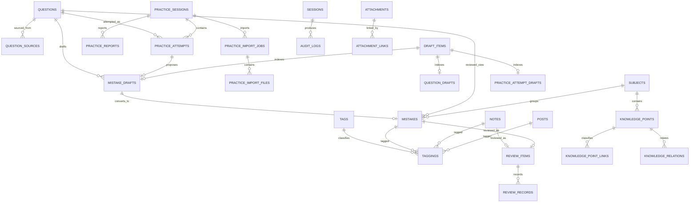

# 目标数据模型

> 本文是字段与关系草案，不是 SQL DDL，也不表示模型或迁移已经实现。

## 建模决策

目标设计中 `mistakes` 是独立实体，不是 `notes.type = "mistake"`。同理：

- `posts`：用于公开发布文章，关注发布生命周期与读者体验。
- `notes`：用于个人知识笔记，关注知识沉淀、关联和选择性公开。
- `questions`：用于保存可复用题目本体，与具体作答和错题复盘分离。
- `practice_sessions` / `practice_attempts`：用于保存一次练习及其中每道题的作答。
- `mistakes`：用于保存需要复盘的错题视图和错题特有信息，不是题目本体的唯一来源。

建议所有主业务表使用 UUID 主键、UTC 时区时间戳和乐观锁版本号。公开 slug 在各资源命名空间内唯一。枚举值由数据库约束或受控字典约束，不接受任意字符串。

## 学习系统表总览

| 分系统 | 拟新增或目标表 |
|---|---|
| 科目 | `subjects`、`subject_review_settings` |
| 知识组织 | `chapters`、`knowledge_points`、`knowledge_aliases`、`knowledge_point_links`、`knowledge_relations`、`tags`、`taggings`、`knowledge_point_suggestions` |
| 题库 | `questions`、`question_sources`、`question_drafts` |
| 练习 | `practice_sessions`、`practice_attempts`、`practice_reports`、`practice_import_jobs`、`practice_import_files`、`practice_attempt_drafts` |
| 错题 | `mistakes`、`mistake_drafts`、`mistake_import_jobs`、`mistake_import_files` |
| 复习 | 第一批：`review_items`、`review_records`、`review_settings`；目标后置：`knowledge_mastery`、`knowledge_mastery_events`、`bkt_parameters`、`question_drill_attempts` |
| 附件/OCR/Capture | `attachments`、`attachment_links`、`attachment_derivatives`、`ocr_jobs`、`ocr_results`、`ocr_blocks`、`capture_jobs`、`capture_results` |
| AI/草稿 | `ai_model_profiles`、`ai_routing_rules`、`ai_prompt_templates`、`ai_runs`、`draft_items`、`question_drafts`、`mistake_drafts`、`practice_attempt_drafts`、`knowledge_point_suggestions`、`note_ai_suggestions` |
| 任务/搜索/统计/设置 | `jobs`、`job_steps`、`job_logs`、`search_index`、`learning_metrics_daily`、`learning_metrics_weekly`、`subject_metric_snapshots`、`knowledge_metric_snapshots`、`learning_reports`、`settings`、`ai_settings`、`ocr_settings`、`upload_settings`、`job_settings`、`privacy_settings`、`setting_change_logs` |

`subject_review_settings` 和 `review_settings` 分别提供科目级覆盖与全局默认；同名概念不重复保存权威值。

`knowledge_mastery`、`knowledge_mastery_events` 和 `bkt_parameters` 是目标表。第一批代码实现只创建 `review_items`、`review_records` 并使用简单 SM-2；BKT 必须等待作答结果、知识点关联与复习历史的数据质量验证通过后再启用。

## 科目与知识组织字段草案

- `subjects`：`id`、`name`、`slug`、`parent_id`、`description`、`current_phase`、`exam_weight`、每日/每周预算、启用状态、排序和时间戳。
- `subject_review_settings`：`subject_id`、每日/每周预算、每日项目/知识点上限、优先权重、启用状态和时间戳。
- `chapters`：`subject_id`、`parent_id`、`name`、`slug`、`description`、`sort_order`、状态和时间戳。
- `knowledge_points`：`subject_id`、`chapter_id`、`name`、`slug`、`description`、状态、版本和时间戳。
- `knowledge_aliases`：`knowledge_point_id`、`alias`、`source`、`is_primary`。
- `knowledge_point_links`：业务对象与知识点的关联，字段为 `id`、`knowledge_point_id`、`target_type`、`target_id`、`link_role`、来源、置信度、确认状态和时间戳。
- `knowledge_relations`：知识点之间的关系，字段为 `id`、`from_knowledge_point_id`、`to_knowledge_point_id`、`relation_type`、来源、确认状态和时间戳；禁止自环与重复边。
- `tags` / `taggings`：标签定义及受控多态关联。
- `knowledge_point_suggestions`：`id`、`draft_item_id`、建议类型、候选数据、来源 AI Run、验证结果、状态和转换引用。

## 上传、识别与草稿字段草案

- `attachment_derivatives`：`attachment_id`、`kind`、`storage_key`、MIME、尺寸、页码、状态和时间戳。
- `ocr_jobs`：`attachment_id`、引擎/版本、状态、进度、尝试次数、错误和时间戳。
- `ocr_results`：`ocr_job_id`、版本、完整文本、结构化结果、语言、质量分和时间戳。
- `ocr_blocks`：`ocr_result_id`、页码、顺序、类型、坐标、文本、置信度和警告。
- `capture_jobs`：输入附件/OCR、规则版本、状态、幂等键和错误。
- `capture_results`：分类、各类型分数、证据、警告、人工覆盖值和时间戳。
- `draft_items`：`id`、`draft_type`、来源类型/ID、状态、版本、验证错误、正式目标类型/ID、创建者和审计时间。它是统一审核索引，不承载各业务草稿的完整类型化字段。
- `question_drafts`：`id`、`draft_item_id`、`subject_id`、`title`、`question_text`、`question_type`、`options`、`correct_answer`、`explanation`、`difficulty`、`source_attachment_id`、`source_ocr_result_id`、`confidence`、`warnings` 和时间戳。
- `mistake_drafts`：`id`、`draft_item_id`、`practice_attempt_id`、`question_id`、题目与答案字段、错因、知识点候选、置信度、警告和时间戳。
- `practice_attempt_drafts`：`id`、`draft_item_id`、`practice_session_id`、`question_draft_id`/`question_id`、`my_answer`、`correct_answer`、`result_type`、`score`、置信度、警告和时间戳。
- `knowledge_point_suggestions`：必须包含 `draft_item_id`，保存建议类型、候选知识点/关系、依据、置信度和转换目标。
- `note_ai_suggestions`：必须包含 `draft_item_id`，保存 `note_id`、建议类型、建议内容、依据、置信度和时间戳。
- 每个细分草稿表通过非空且唯一的 `draft_item_id` 与 `draft_items` 一对一关联。AI、OCR、Capture 输出在进入任何正式表前，必须先创建 `draft_items`，再创建对应类型化草稿。

## 任务、搜索、统计与设置字段草案

- `jobs`：类型、目标、状态、优先级、幂等键、可运行时间、租约、进度、尝试/最大尝试、错误和时间戳。
- `job_steps` / `job_logs`：步骤状态、输入输出引用和结构化安全日志。
- `search_index`：实体类型/ID、标题、规范化文本、subject、visibility、status、tsvector 和源更新时间。
- 日/周指标与 subject/knowledge 快照：统计窗口、口径版本、指标 JSON、源数据截止点和重算状态。
- `learning_reports`：报告类型、时间窗口、`provided_metrics`、规则摘要、可选 AI Run、状态和时间戳。
- `settings`：`id`、`namespace`、`key`、类型化 `value`、`version`、`updated_at`。第一版的 Learning 与 Drafts 配置分别使用 `namespace='learning'` 和 `namespace='drafts'`；不新增 `learning_settings` 或 `draft_settings`。
- 专用设置表只保留有稳定复杂契约的 Review、AI、OCR、Upload、Jobs、Privacy 与 Subject Review；`setting_change_logs` 保存变更前后值的安全摘要。

## 关键关系与约束

1. Subject 一对多 Chapter、Knowledge Point、Question 和科目级统计。
2. Question、Mistake、Note 等业务对象通过 `knowledge_point_links` 连接 Knowledge Point；知识点之间只使用 `knowledge_relations`。
3. Practice Attempt 可生成零或一个 Mistake Draft；确认后映射正式 Mistake。
4. 只有 `active` Mistake 才能成为 Review Item；Review Record 不可变。
5. Knowledge Mastery 以 subject + knowledge point 为唯一学习状态，变化写入不可变事件。
6. Attachment 通过 Attachment Link 关联业务实体，OCR/Capture 只引用附件，不复制原文件。
7. OCR/Capture/AI 输出必须先创建 Draft Item 和类型化草稿；转换正式表必须幂等并保留来源。
8. API Key 只保存 `api_key_ref`；私有原文、密钥和本地路径不得进入 search index 或普通日志。

## 当前兼容与迁移

当前错题仍可能由 `Note(type="mistake")` 承载，旧 review 字段也可能直接位于 Note。目标 `mistakes`、`review_items`、`knowledge_mastery` 等均为**待迁移**，在迁移校验完成前不得删除旧字段或声称独立表已经上线。

## 内容与学习表

### `posts`

- **职责**：公开文章及其发布生命周期。
- **关键字段**：`id`、`slug`、`title`、`summary`、`content`、`status(draft|published|archived)`、`visibility(public|private)`、`cover_attachment_id`、`published_at`、`created_at`、`updated_at`、`version`。
- **关系**：封面指向 `attachments`；通过 `taggings` 关联 `tags`；可作为 `ai_runs` 目标。

### `notes`

- **职责**：个人知识笔记，不含错题专属字段。
- **关键字段**：`id`、`slug`、`title`、`content`、`summary`、`status`、`visibility`、`created_at`、`updated_at`、`version`。
- **关系**：通过 `taggings` 关联标签，通过 `knowledge_point_links` 关联知识点；可通过 `attachment_links` 关联附件、拥有 AI 运行和可选 `review_item`。

### `questions`

- **职责**：保存题目本体，供练习、错题和未来复习场景复用。
- **关键字段**：`id`、`slug`、`title`、`question_text`、`question_type`、`subject_id`、`difficulty`、`source`、`status`、`visibility`、`canonical_hash`（可选）、`normalized_text`（可选）、`created_at`、`updated_at`。
- **关系**：一对多拥有 `question_sources` 和 `practice_attempts`；可被 `mistake_drafts`、`mistakes` 引用；关联 Taxonomy、Attachment 与 AI Run。
- **约束**：规范化文本与 hash 只是去重候选信号，合并题目需要可审计确认；默认私有。

### `question_sources`

- **职责**：记录题目来自试卷、书籍、图片、PDF、手工输入或外部链接等来源。
- **关键字段**：`id`、`question_id`、`source_type`、`source_name`、`source_ref`、`external_url`、`source_location`、`attachment_id`、`page_index`、`ocr_block_id`、`created_at`。
- **关系**：多对一属于 `questions`；可追溯 `attachments` 与 `ocr_blocks`。
- **约束**：`source_location` 是 JSON，可保存 `bbox`、`page_range`、`block_range` 等区域信息；`page_index` 使用统一的零基或一基约定并在 API 契约中固定。外部 URL 与文件引用需要校验，不得保存泄露本地路径的值。

### `question_drafts`

- **职责**：保存由 AI、OCR、Capture Router 或人工导入产生、尚未转换为正式 Question 的类型化题目草稿。
- **关键字段**：`id`、`draft_item_id`、`subject_id`、`title`、`question_text`、`question_type`、`options`、`correct_answer`、`explanation`、`difficulty`、`learning_level`、`source_attachment_id`、`source_ocr_result_id`、`confidence`、`warnings`、`created_at`、`updated_at`。
- **关系**：通过唯一且非空的 `draft_item_id` 一对一属于 `draft_items`；可由 Practice Attempt Draft 引用；确认转换后由 `draft_items.target_id` 指向正式 Question。
- **约束**：题型决定 `options` 与答案 schema；缺失必填字段时统一审核状态为 `needs_fix`；不得绕过 Draft Item 直接写入 `questions`。

### `practice_sessions`

- **职责**：表示一次练习及其汇总状态。
- **关键字段**：`id`、`title`、`subject_id`、`source`、`status(draft|importing|analyzing|needs_review|completed|failed|cancelled)`、`started_at`、`finished_at`、`total_questions`、`correct_count`、`wrong_count`、`partial_count`、`created_at`、`updated_at`。
- **关系**：一对多拥有 `practice_attempts`、`practice_reports` 和 `practice_import_jobs`。
- **约束**：汇总计数由受控服务根据 Attempt 计算，不接受客户端作为权威值；默认私有。

### `practice_attempts`

- **职责**：记录“我在这次练习中这道题做得怎么样”。
- **关键字段**：`id`、`session_id`、`question_id`、`my_answer`、`correct_answer`、`result_type(correct|wrong|partial|unknown|skipped)`、`score`、`duration_seconds`、`mistake_reason`、`analysis`、`confidence`、`warnings`、`created_at`、`updated_at`。
- **关系**：属于一个 Practice Session 和一个 Question；可产生零或一个 Mistake Draft，并可被正式 Mistake 追溯。
- **约束**：`result_type` 是作答结果的权威字段；不得只依赖 `is_correct`。`is_correct` 如在迁移期保留，只能是由 `result_type` 派生的兼容字段。

### `practice_reports`

- **职责**：保存一次练习的 AI 或规则分析报告。
- **关键字段**：`id`、`session_id`、`summary`、`weak_points`、`knowledge_point_stats`、`suggested_review_plan`、`ai_run_id`、`created_at`、`updated_at`。
- **关系**：属于 Practice Session，可关联生成它的 AI Run。
- **约束**：复习建议不是正式 Review Schedule；采纳建议需要独立确认和服务校验。

### `practice_import_jobs`

- **职责**：跟踪一次练习导入任务的进度、结果和失败。
- **关键字段**：`id`、`session_id`、`status`、`source_type`、`total_files`、`processed_files`、`total_items`、`error_message`、`created_at`、`updated_at`。
- **关系**：属于 Practice Session，一对多拥有 `practice_import_files`，关联 AI Runs。
- **约束**：状态转换必须幂等、可重试和可审计。

### `practice_import_files`

- **职责**：记录练习导入任务的原始文件。
- **关键字段**：`id`、`job_id`、`attachment_id`、`file_name`、`mime_type`、`page_index`、`created_at`。
- **关系**：属于 Practice Import Job，文件本体由 Attachment 管理。
- **约束**：不重复保存文件二进制或内部临时路径。

### `mistake_drafts`

- **职责**：保存尚未由用户确认的错题候选。
- **关键字段**：`id`、`draft_item_id`、`practice_attempt_id`、`question_id`、`question_draft_id`、`title`、`question_text`、`my_answer`、`correct_answer_snapshot`、`explanation_snapshot`、`reason_category`、`mistake_reason`、`knowledge_points`、`confidence`、`warnings`、`created_at`、`updated_at`。
- **关系**：优先引用已有 `question_id`；题目尚未正式转换时引用 `question_draft_id`。来源于 Practice Attempt 或受控的单题导入，确认后转换为 Mistake。
- **约束**：`question_id` 与 `question_draft_id` 至少一个非空，并按状态约束避免歧义。`question_text` 只可作为来源快照，不得成为唯一题目来源。AI 输出必须经过用户确认；转换操作幂等，且保留来源与审计记录。

### `mistakes`

- **职责**：保存需要复盘的错题视图和错题特有结论。
- **关键字段**：`id`、`slug`、`question_id`、`practice_attempt_id`、`source_type`、`source_ref`、`title`、`question`、`my_answer`、`correct_answer`、`analysis`、`error_reason`、`difficulty`、`subject_id`、`status`、`visibility`、`created_at`、`updated_at`、`version`。
- **关系**：可追溯 Question、Practice Attempt 或单题导入来源；属于 `subjects`；与 `knowledge_points` 通过 `knowledge_point_links` 关联；通过 `attachment_links` 关联附件；可拥有标签和 AI 运行；由 `review_items` 引用。
- **约束**：不保存 `ef`、`interval`、`repetitions`、`next_review`、`last_reviewed`。

### `review_items`

- **职责**：把一个业务实体注册为可复习对象，并保存当前学习状态。
- **关键字段**：`id`、`target_type(mistake|knowledge_point|question|note)`、`target_id`、`state(active|paused|completed)`、`algorithm`、`algorithm_version`、`ease_factor`、`interval_days`、`repetitions`、`next_review_at`、`last_reviewed_at`、`priority_score`、`created_at`、`updated_at`。
- **关系**：逻辑引用一个 Mistake、Knowledge Point、Question 或 Note；一对多拥有 `review_records`。
- **约束**：`(target_type, target_id)` 唯一。第一版不建立 `review_schedules`；当前调度时间以 `review_items.next_review_at` 为唯一权威字段。

### `review_records`

- **职责**：不可变地记录每一次复习事件。
- **关键字段**：`id`、`review_item_id`、`rating`、`reviewed_at`、`duration_ms`、`previous_state`、`result_state`、`algorithm`、`algorithm_version`、`note`、`created_at`。
- **关系**：多对一属于 `review_items`；操作会话可关联 `sessions`。
- **约束**：记录写入后不更新；算法输入与输出应可追溯。

## AI 与媒体表

### `ai_model_profiles`

- **职责**：保存可选模型连接的非密钥配置和能力声明。
- **关键字段**：`id`、`name`、`provider`、`model_name`、`api_base`、`api_key_ref`、`capabilities`、`input_modalities`、`supports_json_schema`、`context_window`、`default_timeout_ms`、`is_enabled`、`created_at`、`updated_at`。
- **约束**：只保存 `api_key_ref`，不保存明文密钥；连接测试不改变正式路由状态。

### `ai_routing_rules`

- **职责**：把 `task_type` 路由到主模型与 fallback。
- **关键字段**：`id`、`task_type`、`priority`、`conditions`、`model_profile_id`、`fallback_model_profile_ids`、`timeout_ms`、`max_retries`、`is_enabled`、`created_at`、`updated_at`。
- **约束**：同一 task 的启用规则按 priority 确定性匹配；运行时必须把命中的规则 ID 写入 AI Run。

### `ai_prompt_templates`

- **职责**：保存任务型 Prompt 的版本化模板与输出契约。
- **关键字段**：`id`、`task_type`、`name`、`version`、`system_template`、`user_template`、`output_schema`、`validator_config`、`status(draft|active|archived)`、`created_at`、`updated_at`。
- **约束**：`(task_type, name, version)` 唯一；已被 AI Run 引用的版本不可原地覆盖。

### `ai_runs`

- **职责**：记录 AI 任务的完整执行生命周期。
- **关键字段**：`id`、`task_type`、`target_type`、`target_id`、`model_profile_id`、`routing_rule_id`、`prompt_template_id`、`prompt_version`、`status(queued|running|succeeded|failed|cancelled)`、`validation_status(pending|passed|failed|warning)`、`confidence`、`warnings`、`token_input`、`token_output`、`cost_estimate`、`latency_ms`、`input_snapshot`、`output_data`、`error_code`、`error_message`、`attempt`、`parent_run_id`、`started_at`、`finished_at`、`created_by`、`created_at`。
- **关系**：可关联 Post、Note、Question、Practice Import Job、Practice Session、Practice Attempt、Mistake Draft、Mistake 或 Review Item；重试通过 `parent_run_id` 形成链；附件可作为输入或输出。
- **约束**：`model_profile_id`、`routing_rule_id`、`prompt_template_id` 与 `prompt_version` 共同形成运行配置快照；业务实体删除时运行记录应保留并将目标软解绑或快照保留；敏感 prompt 与模型响应需按数据政策脱敏。

### `attachments`

- **职责**：只保存文件本体元数据与存储状态。
- **关键字段**：`id`、`original_name`、`storage_provider`、`storage_key`、`mime_type`、`size_bytes`、`checksum`、`visibility`、`status`、`created_by_session_id`、`created_at`、`deleted_at`。
- **关系**：通过 `attachment_links` 连接 Post、Note、Question、Practice Import、Mistake、OCR Job 或 AI Run；不保存 `owner_type/owner_id` 作为主关系。
- **约束**：`storage_key` 唯一；删除业务实体先进入附件清理队列，不立即造成孤儿文件或误删共享文件。

### `attachment_links`

- **职责**：保存附件与业务对象的唯一主关系模型。
- **关键字段**：`id`、`attachment_id`、`target_type`、`target_id`、`purpose(cover|inline|question|answer|source|ai_input|ai_output)`、`sort_order`、`created_at`。
- **约束**：`(attachment_id, target_type, target_id, purpose)` 唯一；应用服务校验目标存在和可见性；公开 API 只输出已批准的公开链接 DTO。

## Taxonomy 表

### `tags`

- **职责**：可复用的轻量标签字典。
- **关键字段**：`id`、`name`、`normalized_name`、`slug`、`description`、`created_at`。
- **关系**：通过 `taggings` 连接内容实体。
- **约束**：`normalized_name` 唯一。

### `taggings`

- **职责**：连接标签和可标记实体。
- **关键字段**：`id`、`tag_id`、`taggable_type(post|note|question|mistake)`、`taggable_id`、`created_at`。
- **关系**：属于 `tags`，逻辑引用一个目标实体。
- **约束**：`(tag_id, taggable_type, taggable_id)` 唯一。`attachment` 与 `draft_item` 可在后续阶段加入枚举，不属于第一批实现。

### `subjects`

- **职责**：稳定的学科字典。
- **关键字段**：`id`、`name`、`slug`、`description`、`sort_order`、`active`。
- **关系**：一对多关联 `questions`、`practice_sessions`、`mistakes` 和 `knowledge_points`。
- **约束**：`slug`、规范化名称唯一。

### `knowledge_points`

- **职责**：结构化知识点，可形成层级。
- **关键字段**：`id`、`subject_id`、`parent_id`、`name`、`slug`、`description`、`sort_order`、`created_at`、`updated_at`。
- **关系**：属于 Subject；可有父 Knowledge Point；通过 `knowledge_point_links` 关联业务对象，通过 `knowledge_relations` 关联其他知识点。
- **约束**：同一 Subject 内 slug 唯一；禁止形成层级环。

### `knowledge_point_links`

- **职责**：只表达业务对象与知识点的关联。
- **关键字段**：`id`、`knowledge_point_id`、`target_type(note|question|mistake|practice_attempt)`、`target_id`、`link_role(primary|secondary|suggested)`、`source_type`、`source_id`、`confidence`、`is_confirmed`、`created_at`。
- **约束**：`(knowledge_point_id, target_type, target_id, link_role)` 唯一；多态目标由服务校验。`source_type/source_id` 仅用于追踪关联建议或导入来源，不得替代当前目标引用。

### `knowledge_relations`

- **职责**：只表达知识点与知识点之间的有向关系。
- **关键字段**：`id`、`from_knowledge_point_id`、`to_knowledge_point_id`、`relation_type(prerequisite_of|related_to|contains|confusable_with)`、`weight`、`source`、`is_confirmed`、`created_at`。
- **约束**：禁止自环；同类型有向边唯一；AI 只能生成待审核建议。

## Auth 与审计表

第一版采用脚本生成的单管理员通行密钥，不设计 `admin_users`、`password_hash`、`passkeys` 或多用户 RBAC。通行密钥本体来自服务端安全配置，不写入业务数据库。

### `sessions`

- **职责**：可撤销的管理员登录会话。
- **关键字段**：`id`、`token_hash`、`auth_method(access_key)`、`expires_at`、`revoked_at`、`ip`、`user_agent`、`created_at`、`last_seen_at`。
- **关系**：由成功的通行密钥验证创建；被 `audit_logs` 引用。
- **约束**：只存 token 哈希；过期与撤销必须由后端每次校验。

未来如引入账号密码、Passkey 或多用户权限，必须作为独立认证架构阶段新增模型与迁移；不属于第一版。

### `audit_logs`

- **职责**：不可变记录敏感操作与关键状态变化。
- **关键字段**：`id`、`session_id`、`actor_type(admin_access_key)`、`action`、`entity_type`、`entity_id`、`before_data`、`after_data`、`request_id`、`ip`、`user_agent`、`result`、`created_at`。
- **关系**：关联管理员会话；通过类型与 ID 指向业务实体。
- **约束**：业务事务成功后同事务或可靠 outbox 写入；敏感字段脱敏；普通管理员不可修改或删除。

## 关系示意

语义必须保持清晰：

- `practice_attempts` 记录“我这次做得怎么样”。
- `mistakes` 记录“哪些题需要复盘”。
- `review_items` 记录“哪些对象进入复习系统”。
