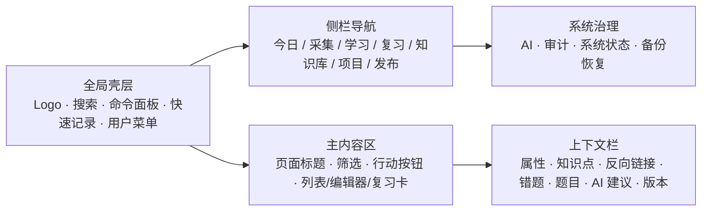
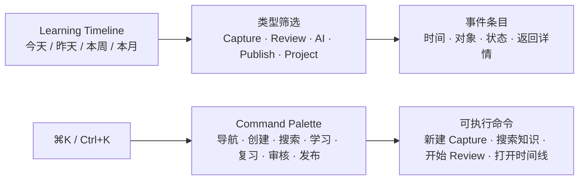

# 个人学习系统 V2 最高层架构

> 状态：目标架构与执行基线，待分阶段审批和迁移验证。本文档不表示代码、数据库、API、部署或数据迁移已经完成。

## 1. 产品定位

系统从“博客、笔记、错题、复习和 AI 功能的组合”重构为统一的个人学习工作台。唯一主链是：

```text
采集 -> 整理 -> 建立知识关系 -> 学习与练习 -> 发现错误 -> 进入复习 -> 形成总结 -> 选择性发布
```

知识节点统一连接笔记、题目、错题、复习、项目、资料、AI 分析和公开文章，但只拥有知识身份、别名、标签和关系；学习掌握度、复习时间、项目状态、发布状态和 AI 审核状态分别归属于各自 Bounded Context。Obsidian 只作为 Markdown、WikiLink、反向链接、模板、命令面板和本地可迁移性的产品参考，不参与系统运行。

## 2. 总体边界

项目保留两条清晰的技术线：

- Next.js App Router 下的公开内容和原始静态博客系统。
- FastAPI、PostgreSQL、JWT、Redis 下的私有个人学习系统。

两条线共享必要的内容、渲染、认证和发布基础设施，但不得继续为同一业务维护两套可独立修改的主数据。

PostgreSQL 是正式数据的唯一事实来源。GitHub Markdown 只承担导出、版本归档、公开站点构建输入和灾难恢复副本。

## 3. 目标架构

```text
Next.js Web
  Today / Capture / Learn / Review / Knowledge / Projects / Publish
        |
FastAPI Application
  Identity / Content / Knowledge / Learning / Review / Search
  Ingestion / Publishing / AI Gateway / Audit / Statistics / Administration
        |
PostgreSQL -------- Redis
        |              |
        +---- Worker: OCR / AI / Index / Export / Backup / Reports
```

推荐的长期仓库边界为 `apps/web`、`apps/api`、`apps/worker`、`packages/contracts`、`packages/ui`、`packages/markdown`、`migrations`、`scripts`、`infra` 和 `docs`。当前 `src/` 与 `backend/` 可按独立阶段逐步迁移，不要求本阶段立即移动目录。

## 4. 产品信息架构

一级导航控制在七项以内：

```text
今日 | 采集 | 学习 | 复习 | 知识库 | 项目 | 发布
```

全局入口为搜索、命令面板、快速记录和个人设置。管理端不进入日常主导航，只负责 AI 治理、审计、系统状态、备份恢复和其他系统治理。

主要路由目标：

```text
/today                 /capture                 /learn
/review                /knowledge               /graph
/search                /projects                /publish
/manage/ai             /manage/audit             /manage/system
/manage/backups
```

## 5. 核心数据模型

### 5.1 统一内容

`content_items` 保存 `note`、`article`、`solution`、`summary`、`reference`、`project_document` 和 `daily_log` 等正文；`content_revisions` 保存版本、变更摘要和创建者。正文统一使用 Markdown，并支持公式、代码块、图片和 WikiLink。

### 5.2 知识节点与关系

`knowledge_nodes` 只保存概念、公式、定理、算法、数据结构、章节、课程、工具和项目主题等知识身份。`knowledge_edges` 保存前置、包含、相关、相似、对比、应用、派生、示例和使用关系，并记录置信度、来源、证据内容和审核状态。掌握度属于 Learning/Analytics projection，复习时间属于 Review，项目关联属于 Project，发布状态属于 Publish，AI 建议状态属于 AI。

`content_knowledge_links` 保存内容与节点的主关联、提及、前置、应用和错因来源。Markdown 保存时解析：

```markdown
[[二叉树]]
[[TCP 拥塞控制|拥塞控制]]
```

已有 canonical name 或 alias 则建立关联；不存在则创建待确认节点。反向链接和图谱由关系数据自动生成，不要求用户手动画线。

### 5.3 题目、作答与错题

`questions` 保存题目本体、选项、答案、解析、来源、难度和科目；`question_attempts` 保存某次作答事实；`mistake_cases` 表示一次具体错误，保存错误类型、错误原因、正确方法、预防规则、严重程度、状态和关联正文。

错误类型包括概念缺失、公式记忆、计算、忽略条件、方法选择、阅读错误、时间管理和粗心。错题关闭必须具备原因分析、预防规则、至少一次延迟复习、再次作答正确和知识点掌握恢复等证据。

### 5.4 复习

`review_items` 可指向知识点、错题、题目、公式或内容；`review_events` 保存遗忘、困难、记住和简单等结果。调度器独立为接口，首版依据最近结果、连续正确次数、错误严重程度、知识重要性、考试时间和逾期情况计算下一次复习。

### 5.5 采集、任务与发布

所有未经整理的文本、图片、PDF、网页摘录、截图和 AI 对话结果先进入 `ingestion_items`，经历 `new -> processing -> needs_review -> structured / archived / failed`。OCR、AI、索引、导出、备份和报告由 Redis 队列和 worker 承担，使用 `jobs` 记录进度、重试和错误。

公开内容通过 `publish_snapshots` 绑定源内容和源版本，发布前执行隐私、引用和公开版本检查。撤回时同步处理公开索引、静态导出、缓存、sitemap 和搜索索引；私有原稿是否删除由用户单独决定。

## 6. 今日工作台与采集

`/today` 默认显示今日目标、待处理采集、到期复习、最近错题、进行中的科目、项目任务和 AI 待审核建议。它由 `TodayOrchestrator` 编排各 Context 的只读摘要，只提供行动项，不拥有错题、复习、项目或 AI 的业务写入逻辑。

`/capture` 支持快速记录想法、问题、知识点、错题截图、手动文本和文件导入。图片错题采用一页式审核：上传原图、OCR、用户校正、AI 生成知识点与错因候选、用户确认，最后生成题目、错题和复习项。

## 7. 编辑、搜索与项目

统一 Markdown 编辑工作台支持编辑/预览分栏、公式、代码、图片拖入、WikiLink 和标签补全、知识点搜索、模板、自动保存、版本历史和专注模式。右侧上下文栏展示属性、关联知识点、反向链接、引用、相关错题、相关题目、AI 建议和历史版本。

首版搜索使用 PostgreSQL 全文搜索、trigram 模糊匹配和结构化过滤，不引入向量数据库。项目用于管理学习课程、算法训练、博客重构和研究任务，项目中产生的知识可以沉淀为知识节点。

## 8. AI 与安全

现有 AI Gateway、Provider 路由、Prompt、Task、Validator 和 AI Run 审计能力继续复用。AI 任务可包括 OCR、错题分析、关系建议、薄弱点分析、每日总结、周报和引用支撑生成。

AI 输出状态必须为：

```text
generated -> pending_review -> accepted / rejected
```

AI 不直接修改正式知识库。每项建议都要记录依据、关联对象、置信度和 AI Run ID；事实性总结保存引用关系。日志不得暴露 API Key、Authorization、Cookie、Token、原始 Prompt 或敏感输入摘要。

所有私有实体保留 `owner_id`。创建、更新、删除、上传、AI 写操作、复习提交和统计接口都必须由后端认证依赖保护；公开读取只返回已发布且未隐藏的内容。删除采用软删除、审计和恢复入口。生产环境关闭开发认证绕过，固定域名和 Named Tunnel 后运行生产构建、FastAPI、PostgreSQL、Redis 和 worker，并执行每日备份和恢复演练。

## 9. 分阶段执行流程

```text
冻结与审计
  -> 基础架构与安全
  -> 统一数据模型
  -> 今日工作台与采集
  -> 知识库与编辑器
  -> 错题与复习闭环
  -> AI 管家
  -> 发布与迁移切换
  -> Legacy 清理与归档
```

阶段 A 先盘点数据、路由、API、权限、旧写入口和重复内容；阶段 B 先建立安全和可恢复基础；阶段 C 才建立统一模型；阶段 D/E/F 逐步把日常学习主链跑通；阶段 G 接入可审核 AI；阶段 H 才执行发布收敛、旧数据迁移、URL 重定向和旧系统只读归档；阶段 Z 最后删除满足条件的 Legacy 页面、API、表、同步适配器和 feature flag。

每个阶段必须独立建立需求、设计、任务清单，并在任务批准后执行。每完成一个任务立刻更新任务清单；每个阶段收口时必须留下验收证据、剩余风险和下一轮需求。未完成备份、回滚、权限和数据完整性验证前，不得执行不可逆删除或双数据源切换。

## 10. 验收基线

产品验收必须覆盖：打开系统即可看到今日任务；一次采集能进入 OCR、整理、知识点绑定和复习创建；知识点能聚合笔记、题目、错题和复习；错题能追踪到再次作答；公开文章有明确来源和版本。

数据验收必须覆盖：PostgreSQL 唯一主数据、owner 完整、外键完整、迁移可追溯、正文和附件哈希、删除恢复和版本回滚。AI 验收必须覆盖 AI Run、Prompt/模型版本、引用、人工审核、可撤销和敏感日志过滤。工程验收必须覆盖 TypeScript、生产构建、后端测试、迁移可重复、权限测试、备份恢复和健康检查。

## 11. 当前决策

立即停止继续添加孤立页面和独立功能。后续开发必须至少接入统一采集链、知识节点、错题复习闭环、统一内容模型、重复入口收敛、双数据源消除或可追溯性提升之一。

本架构文档由任务组 [Personal Learning System V2](../workflows/personal-learning-system-v2/README.md) 管理；具体实施必须以该任务组获批的阶段任务清单为准。

关键取舍记录在 [Architecture Decision Records](../adr/README.md)。

## 12. 完整 UI 设想图

### 12.1 页面与数据流总图

```mermaid
flowchart TB
    Login[登录] --> Today[/today 今日工作台]
    Today --> Review[/review 今日复习]
    Today --> Capture[/capture 采集箱]
    Today --> Learn[/learn 学科工作台]
    Today --> Projects[/projects 项目]
    Today --> Knowledge[/knowledge 知识库]
    Today --> Publish[/publish 发布中心]
    Global[全局搜索 / 命令面板 / 快速记录] --> Today

    Capture --> Text[文字记录]
    Capture --> Image[截图 / 图片]
    Capture --> File[PDF / Markdown / 网页摘录]
    Image --> OCR[OCR + 用户校正]
    OCR --> Draft[待审核草稿]
    Text --> Draft
    File --> Draft
    Draft --> Content[ContentItem]
    Draft --> Question[Question]
    Question --> Attempt[QuestionAttempt]
    Attempt --> Mistake[MistakeCase]
    Mistake --> Review

    Content --> Wiki[WikiLink / 反向链接]
    Question --> Wiki
    Mistake --> Wiki
    Wiki --> Node[KnowledgeNode]
    Node --> Graph[局部图谱 / 全局图谱]
    Node --> Weak[掌握度 / 薄弱点]
    Weak --> Review

    AI[AI Gateway] --> Suggestion[建议 / 草稿 / 报告]
    Suggestion --> Human[人工接受 / 拒绝]
    Human --> Content
    Human --> Node
    Human --> Review
    Content --> Snapshot[PublishSnapshot]
    Snapshot --> Public[公开文章 / 公开笔记]
```

### 12.2 桌面工作台线框



### 12.3 今日与采集页面线框

```mermaid
flowchart TB
    TodayHeader[今日标题 + 目标 + 快速记录]
    TodayActions[复习到期 | 待整理采集 | 最近错题 | 当前学习 | 项目任务 | AI 待审核]
    TodayState[每个区块：loading / empty / error / busy / success]
    TodayHeader --> TodayActions --> TodayState

    CaptureHeader[采集箱标题 + 文字 / 截图 / 文件 / 快速记录]
    CaptureList[待处理列表<br/>状态 · 来源 · 时间 · 类型]
    CaptureDetail[详情审核<br/>原图/OCR · 结构化字段 · 知识点 · 错因 · 保存草稿]
    CaptureHeader --> CaptureList --> CaptureDetail
```

### 12.4 知识节点与复习页面线框

```mermaid
flowchart LR
    NodeHeader[知识节点标题<br/>科目 · 掌握度 · 重要性 · 编辑 · 开始复习]
    NodeBody[正文与 Markdown 渲染]
    NodeRelations[关系上下文<br/>前置 · 相关 · 反向链接 · 题目 · 错题 · 项目]
    NodeGraph[局部图谱 / 关系列表降级]
    NodeHeader --> NodeBody
    NodeHeader --> NodeRelations
    NodeRelations --> NodeGraph

    ReviewHeader[复习进度 + 来源 + 退出]
    ReviewCard[中央题目/知识点内容]
    ReviewActions[遗忘 | 困难 | 记住 | 简单]
    ReviewNext[下一次复习时间 + 撤销]
    ReviewHeader --> ReviewCard --> ReviewActions --> ReviewNext
```

### 12.5 移动端 UI 线框

```mermaid
flowchart TB
    MobileTop[顶栏：当前页面 + 搜索 + 菜单]
    MobileContent[单列内容<br/>列表 / 表单 / 复习卡 / 详情]
    MobileAction[底部动作栏：今日 | 采集 | 复习 | 更多]
    MobileTop --> MobileContent --> MobileAction
    MobileAction --> Drawer[抽屉：学习 / 知识库 / 项目 / 发布 / 设置]
```

### 12.6 Learning Timeline 与 Command Palette



Learning Timeline 是跨领域只读查询，Command Palette 复用已有 API client；二者都必须遵守公开读取与管理员操作边界。

完整页面行为、状态、组件和响应式细节见 [ui-design.md](../workflows/personal-learning-system-v2/ui-design.md)。
