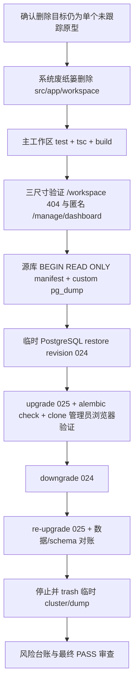

# CLEANUP 设计文档

## 总体流程

## `/workspace` 删除设计

- 删除对象必须先解析为绝对路径：
  `/Users/limengyang/2025-blog-public/src/app/workspace`
- 删除前记录：
  - `git status --short -- src/app/workspace`
  - `rg --files src/app/workspace`
  - 文件 SHA-256
- 预期仅有未跟踪 `page.tsx`。若事实不同，停止。
- 使用 `/usr/bin/trash`，不使用递归 `rm`。
- 不修改 `next.config.ts`，不创建 redirect。

## 浏览器设计

在 390×844、1280×800、1440×900：

- `/workspace`
  - 显示 Next.js 404；
  - 不出现旧“学习工作区”原型文案；
  - 无横向溢出。
- `/manage/dashboard`
  - 匿名回到 `/manage` 登录态；
  - 临时管理员进入 Dashboard；
  - 无横向溢出。

为避免与“日常库只读”边界冲突，浏览器验证拆为两段：

1. 删除后立即在本地主工作区验证 `/workspace` 与匿名 `/manage/dashboard`。
2. CLEANUP-06 恢复 clone、CLEANUP-07 升级到 025 后，在独立后端/前端端口
   上通过项目 CLI 向 **clone** 创建临时管理员，完成管理员三尺寸验收后立即禁用。

不得在日常库创建、旋转或禁用临时管理员；不得使用 AUTH_BYPASS。

## 数据库隔离设计

### 源库

- 目标固定：`localhost:5432/blog_db`。
- 仅允许：
  - `BEGIN READ ONLY` manifest；
  - custom-format `pg_dump --no-owner --no-acl`。
- dump 写入 `mktemp -d` 创建的精确临时根目录。
- dump 完成后记录 SHA-256 和 `pg_restore --list` 可读性。

### 临时 cluster

- `initdb` 创建独立 data directory。
- 选择未占用的高位 TCP 端口；禁止 5432。
- Unix socket 放在短路径临时目录，避免路径长度问题。
- `pg_ctl` 启动后 `createdb`，`pg_restore` 恢复。
- 所有 Alembic 命令显式传递 clone DATABASE_URL；不依赖默认 `.env`。

### 025 验证

验证对象：

- revision=`025`；
- `ix_admin_sessions_token_hash` unique；
- `ix_admin_sessions_user_id`；
- `ix_daily_songs_date` unique；
- `ix_music_candidates_netease_id`；
- 025 `NOT_NULL_DEFAULTS` 中 12 列均为 NOT NULL 且 NULL 数为 0；
- `alembic check` 无新 operations；
- 应用 readiness 和 P0-AUTH 后端组合测试在 clone 运行。

### 回滚重放

在 clone：

1. 025 manifest。
2. `alembic downgrade 024`，确认旧 constraint/index 形态恢复。
3. `alembic upgrade 025`。
4. 再次运行 revision/schema/data manifest 与 `alembic check`。

数据一致性至少覆盖 025 触及表的行数和稳定字段哈希；时间/默认值变化必须单独解释，不能静默忽略。

## 清理设计

- `pg_ctl stop` 成功后确认端口不再监听。
- 将整个临时根目录交给 `/usr/bin/trash`。
- 再次只读查询源库 revision，必须仍为 024。
- 工作树不得出现 `.dump`、数据库目录、连接凭据或个人数据导出。

## 停止条件

- 删除目录内容与基线不符。
- 任一命令目标解析到工作区根、用户目录或 5432 源库写入。
- dump 不可读或 hash 缺失。
- clone 不是 024、upgrade/downgrade/check 任一步失败。
- 源库 revision 或只读 manifest 发生变化。
- 主工作区 tsc/build 或三尺寸浏览器未通过。
