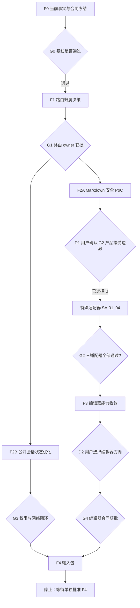

# 设计：F4 前总工作夹

## 一、总架构

本工作夹不是新的业务模块，而是 F4 前四个阶段和五个子任务组的编排层。F4 只接收本工作夹输出的输入包，不在本轮执行。



路由归属是共同前置。Markdown/G2 与公开会话状态可以分轨推进；编辑器线等待 G2，F4 输入包等待 G3 和 G4。本轮形成输入包后停止，不启动生产构建、合成数据或性能采样。

## 二、当前状态与执行序列

| 工作线 | 当前事实                            | 本工作夹动作                  |
| ------ | ----------------------------------- | ----------------------------- |
| F0/G0  | COMPLETE / PASS                     | 只复用，不重做                |
| F1/G1  | COMPLETE / PASS；兼容共存、暂缓切换 | 只复用，不实施路由变更        |
| F2A/G2 | D1 已选 B；G2 BLOCKED / NOT GO      | 三适配器全部启用后再关闭 G2   |
| F2B/G3 | 未开始；G0/G1 已满足                | 执行 PSS-01～06 并形成 G3     |
| F3/G4  | 未开始；等待 G2                     | 执行 E1～E5，提交 D2，形成 G4 |
| F4     | 未开始                              | 只生成输入清单与风险包        |

严格顺序为：

`D1(B) -> SA-01..04/G2 -> PSS-01..06/G3 -> E1..E5/D2/G4 -> F4 输入包 -> STOP`

为保持大任务的单线可审计顺序，先关闭特殊适配器/G2，再执行 PSS-01～06/G3。E1 不得在 G2 关闭前开始。每个任务完成后必须立即更新总 `tasks.md`、对应子任务 `tasks.md` 和两级 `validation.md`。

## 三、阶段与产物

| 阶段    | 所属子任务                        | 允许产物                                  | 禁止提前进入                |
| ------- | --------------------------------- | ----------------------------------------- | --------------------------- |
| F0      | 总任务组                          | 当前事实矩阵、冲突、依赖和审批状态        | 任何源代码修改              |
| F1      | route-ownership-alignment         | 路由建议和后续实现清单                    | 重定向、删除、导航切换      |
| F2A     | markdown-rendering-security-poc   | 隔离 parser/renderer PoC、测试、go/no-go  | 生产消费者迁移              |
| F2B     | public-session-state-optimization | optional/strict 会话分层及浏览器证据      | 权限放宽、AuthGate 删除     |
| F3      | editor-convergence                | 能力矩阵、共享原语/共存方案、后续实现清单 | 强制 UnifiedEditor          |
| F4 输入 | 本总工作夹                        | G3/G4 结论、场景/数据/风险/验证清单       | F4 实施、部署或真实性能优化 |

## 四、用户决策与代理决策边界

| 决策               | 为什么必须由用户判断                                     | 推荐默认                                        | 触发时点          |
| ------------------ | -------------------------------------------------------- | ----------------------------------------------- | ----------------- |
| D1 G2 产品接受边界 | inert 特殊块是否可接受会直接改变作者和读者看到的内容能力 | **已选择方案 B：三类适配器全部启用后才关闭 G2** | 2026-08-16 已决定 |
| D2 编辑器方向      | 共存、最小提取或统一编辑器会改变长期创作体验和维护成本   | 最小共享原语 + 领域编辑器共存                   | E1～E4 证据完成后 |

下列事项由执行代理按测试和现有模式决定，不逐项询问：optional-session 响应的最小布尔结构、严格错误保留、SWR key/失效策略、测试文件位置、消费者迁移顺序、可逆的内部抽取边界。

下列事项不在本轮决策范围：JWT/Bearer 迁移、路由删除/重定向、生产 Markdown 切换、视觉 Token/导航/弹层改造、F4 实施、Git 发布和部署。若执行需要其中任何一项，立即停止并另立任务。

## 五、G0 合同冲突冻结

当前有一项必须显式处理的规则/实现差异：

- 仓库规则描述后端受保护写入采用 Bearer/JWT；
- 近期源代码和浏览器证据显示管理登录使用 HttpOnly `admin_session` Cookie。

F0 必须用当前路由、依赖、测试和客户端调用确认实际合同，并记录：

1. 哪种机制是当前实现事实；
2. 哪种机制是目标架构；
3. 本大类是否只优化现有机制，还是需要另立认证迁移任务。

未形成记录前，F2B 不允许修改 auth schema、router、hook 或客户端。

### G0 决定（2026-08-10）

`PASS — 已冻结，不等于认证迁移完成`。

- 当前实现事实：Cookie 路径 `/api` 的 stateful `admin_session` 与数据库 `AdminSession`，前端请求使用 `credentials: 'include'`；严格 `/api/auth/me` 和 `get_current_admin` 都以该会话为输入。
- 目标架构规则：`AGENTS.md` 规定受保护 mutation 使用 Bearer/JWT；当前代码没有实施该 transport/credential 合同。
- 本任务组只优化当前 Cookie 会话的 public display-state 行为，绝不迁移认证提供方、放宽 strict endpoint 或 mutation 依赖。Bearer/JWT 对齐是独立、须重新授权的任务。
- 因此，F1 可以开始；F2B 只能在 G1 后按此冻结边界执行。出现任何需要双栈、JWT 发行、CORS 变更或 `AUTH_BYPASS` 的设计，即停止并拆分任务。

## 六、数据流边界

前端保持：

```text
page/component -> hook/local action -> src/lib/api/* -> backend API
```

后端保持：

```text
router -> schema validation -> auth/service/model -> response schema
```

Markdown PoC 可以在隔离模块中存在，但未通过 G2 前不得成为公开或管理员页面的第二生产渲染源。

## 七、权限设计

- 公开：`/notes`、`/notes/[slug]`、`/blog`、`/blog/[slug]`、`/mistakes`；
- 严格管理员：创建、编辑、复习、AI、上传和 manage 工具；
- optional 会话状态仅控制管理控件显示；
- strict 会话和后端依赖继续决定真实访问；
- 不新增假想 `/api/mistakes` 或独立 mistake 表。

## 八、异常和停止策略

- 路由 owner 未定：停止所有路由/导航切换；
- Markdown 特殊渲染失败：隔离失败块，禁止全局退回不安全 HTML；
- 编辑器字段无法统一：选择共存，不丢失 mistake 一等字段；
- auth 合同冲突未解：停止会话接口修改；
- 生产构建无法隔离：停止性能验收，不连接真实公网 API；
- 任何公开页面被错误封闭或管理员写权限变弱：立即回滚该阶段。
- 认证合同：若后续动作无法同时保持当前 Cookie 严格权限与记录的 Bearer/JWT 目标差异，停止该动作；不得以本 Gate 作为迁移授权。

## 九、验证矩阵

| 维度     | 自动化                         | 浏览器/运行时          | 必须证明                      |
| -------- | ------------------------------ | ---------------------- | ----------------------------- |
| 路由     | 链接/路由测试                  | 公共与管理员入口       | owner 和兼容策略一致          |
| Markdown | 单元、SSR、hydration、类型检查 | 恶意和特殊块           | 不执行危险内容                |
| 编辑器   | 字段、保存、预览测试           | note/blog/mistake 流程 | 无数据丢失和越权              |
| 会话     | 后端权限、hook/AuthGate 测试   | 匿名/管理员/登出/过期  | 无匿名 401 噪音且严格权限不变 |
| 性能     | build、数据计数、样本重算      | ≥10 个有效样本/场景    | ready 时点、失败率和边界清晰  |

## 十、回滚和提交边界

- 每个子任务单独 diff、验证和提交候选；
- 一个子任务失败不回滚用户或其他任务的已有修改；
- 只有另行执行并通过 F4/G5 后，才讨论视觉系统迁移或发布；
- 总任务批准不等于推送、部署或数据库迁移批准。
