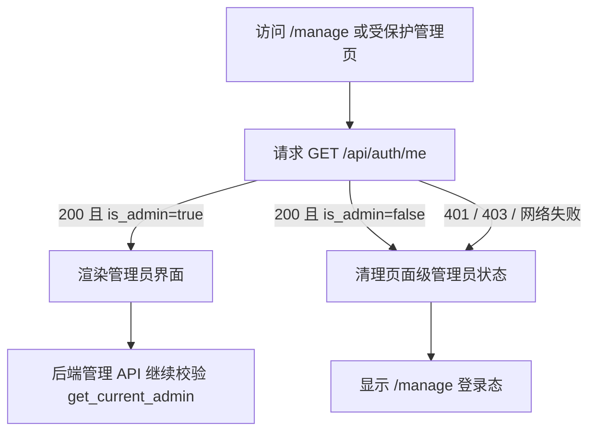

# P0-AUTH 设计文档

## 根因与修复方向

### 已证实根因

- `/manage` 的页面状态只判断 `getMe()` 是否成功，不判断 `user.is_admin`。
- `AuthGate` 语义虽然是管理员布尔值，但共享的 `useAdminAuth` 使用长期 dedupe 且关闭 focus/reconnect revalidation；降权后的旧缓存不能作为受保护入口的当前权限证明。

### 设计原则

使用既有 `/api/auth/me` 作为唯一前端身份事实源。普通展示组件可以继续复用缓存；页面级 `AuthGate` 必须取得当前、严格的管理员判定。`/manage` 与 `AuthGate` 对 `is_admin !== true` 采取相同的 fail-closed 行为。

不改变 cookie、session、JWT、Passkey、AUTH_BYPASS 或后端认证模型。

## 前端状态流



## 页面设计

### `/manage`

- checking：显示既有“验证中…”。
- admin：显示旧管理面板。
- anonymous/non-admin/invalid/error：显示 LoginForm。
- 登录成功回调必须再次确认返回用户为管理员；普通用户登录成功不能进入面板。

### `/manage/dashboard` 及其他 AuthGate 页面

- loading：显示验证中，不渲染 children。
- admin：渲染 children。
- non-admin/invalid/error：`replace('/manage')`，children 保持 `null`。
- 严格核验不得依赖可能仍为 true 的旧展示缓存。

## API 与数据设计

- 不新增或修改 API。
- 使用现有 `GET /api/auth/me`：

  ```text
  200 { id, username, is_admin, auth_level }
  401 Not authenticated
  ```

- 降权用户 `/api/auth/me` 仍可能返回 200 + `is_admin=false`，前端必须显式处理。
- 数据库/schema/migration：无。

## 后端权限验证设计

### 完整依赖审计

从 FastAPI `APIRoute` 注册表枚举 POST/PUT/PATCH/DELETE：

1. 排除明确公开的认证入口和公开留言创建。
2. 其余管理写路由必须在依赖树中包含 `get_current_admin` 或 `get_passkey_admin`。
3. 失败输出 method/path，防止未来新增路由漏保护。

### 运行时契约

使用现有 TestClient 和受控 session resolver，验证代表 create/update/delete 的 Note 写路由：

- POST `/api/notes`
- PUT `/api/notes/{slug}`
- DELETE `/api/notes/{slug}`

鉴权必须在业务写入前失败；匿名/失效 cookie 为 401，非管理员为 403。管理员成功链继续由既有路由测试覆盖，不向日常数据库写入。

## 公开读取设计

- 不修改 `/blog`、`/notes`、`/mistakes` 页面。
- 保留 Batch 7 静态边界测试。
- 浏览器匿名访问三页，确认页面渲染且没有被重定向到 `/manage`。

## 浏览器矩阵

每个角色在 390×844、1280×800、1440×900 下检查两条管理路由：

| 角色 | `/manage` | `/manage/dashboard` |
|---|---|---|
| 匿名 | 登录态 | 回到 `/manage` 登录态 |
| 管理员 | 管理面板 | Dashboard |
| 降权用户 | 登录态 | 回到 `/manage` 登录态 |
| 失效 cookie | 登录态 | 回到 `/manage` 登录态 |

管理员降权使用项目 CLI 的临时管理员流程；失效 cookie 使用受控、明确无效的本地 cookie。不得使用 AUTH_BYPASS。

## 异常与停止条件

- 任一非管理员角色看到管理 children、内容列表或编辑/删除操作：停止，状态 `FAIL`。
- 任一管理写路由缺管理员依赖：停止，不用 allowlist 掩盖。
- 公开页面被 AuthGate、重定向或出现管理员 API 错误噪音：停止。
- 修复需要改变 JWT/Passkey/AUTH_BYPASS/session schema：超出范围，停止并重新审批。
- 主工作区仅因 `/workspace` 原型失败：保留证据并做隔离 scoped 验证，但最终不得标全仓 `PASS`。

